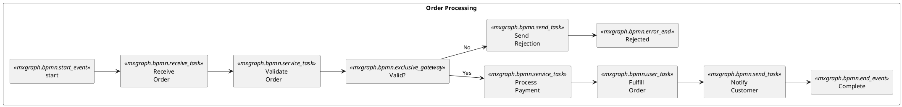
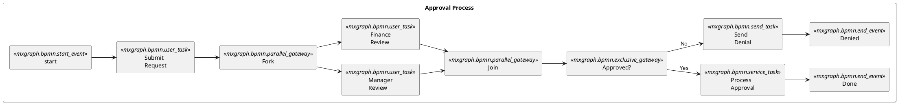
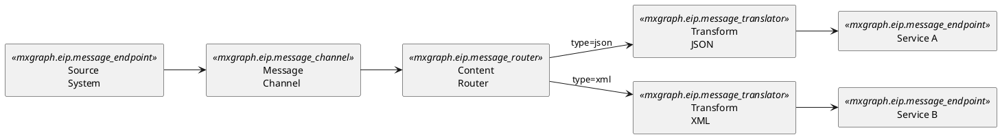
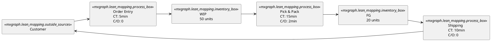

# Workflow Diagram Generator

**Quick Start:** Choose diagram type (BPMN/EIP/Lean) -> Set direction -> Define pools/lanes -> Add events, gateways, tasks -> Connect with arrows.

## Critical Rules

### Rule 1: PlantUML Code Fence
Always output inside ` ```plantuml ` fenced code blocks with `@startuml` / `@enduml`.

### Rule 2: Direction
Use `left to right direction` for horizontal workflows (most common). Omit for top-to-bottom.

### Rule 3: Stencil Icon Syntax
Use `mxgraph.<library>.<icon>` format inside `<<...>>` stereotypes:
- **BPMN**: `mxgraph.bpmn.start_event`, `mxgraph.bpmn.end_event`, `mxgraph.bpmn.exclusive_gateway`, `mxgraph.bpmn.task`
- **EIP**: `mxgraph.eip.message_channel`, `mxgraph.eip.message_router`, `mxgraph.eip.message_endpoint`
- **Lean**: `mxgraph.lean_mapping.process_box`, `mxgraph.lean_mapping.inventory_box`

### Rule 4: Automatic Colors
Icons defined with `mxgraph.*` stencils receive vendor-appropriate colors automatically; do not set manual colors for stencil icons.

### Rule 5: Container Shapes
| Container | Syntax | Use For |
|---|---|---|
| Pool / Lane | `rectangle "Pool Name"` | Organizational boundaries |
| Subprocess | `package "Sub" { }` | Grouped steps |
| System boundary | `cloud "External" { }` | External integrations |

### Rule 6: Connection Types
| Type | Syntax | Meaning |
|---|---|---|
| Sequence Flow | `-->` | Normal process flow |
| Message Flow | `..>` | Cross-pool communication |
| Association | `--` | Annotation / data object link |

## BPMN Elements

### Events
| Element | Stereotype | Use For |
|---|---|---|
| Start Event | `<<mxgraph.bpmn.start_event>>` | Process start |
| End Event | `<<mxgraph.bpmn.end_event>>` | Process end |
| Timer Event | `<<mxgraph.bpmn.timer_start>>` | Scheduled trigger |
| Message Event | `<<mxgraph.bpmn.message_start>>` | Message trigger |
| Error Event | `<<mxgraph.bpmn.error_end>>` | Error termination |

### Gateways
| Element | Stereotype | Use For |
|---|---|---|
| Exclusive (XOR) | `<<mxgraph.bpmn.exclusive_gateway>>` | One path only |
| Parallel (AND) | `<<mxgraph.bpmn.parallel_gateway>>` | All paths concurrently |
| Inclusive (OR) | `<<mxgraph.bpmn.inclusive_gateway>>` | One or more paths |
| Event-Based | `<<mxgraph.bpmn.event_gateway>>` | Wait for event |

### Tasks
| Element | Stereotype | Use For |
|---|---|---|
| User Task | `<<mxgraph.bpmn.user_task>>` | Human interaction |
| Service Task | `<<mxgraph.bpmn.service_task>>` | Automated service |
| Script Task | `<<mxgraph.bpmn.script_task>>` | Script execution |
| Send Task | `<<mxgraph.bpmn.send_task>>` | Send message |
| Receive Task | `<<mxgraph.bpmn.receive_task>>` | Wait for message |

## Template: Order Processing Workflow



## Template: Approval Workflow with Parallel Tasks



## Template: Enterprise Integration Pattern (EIP)



## Template: Value Stream Map (Lean)



## Best Practices

1. **Use BPMN for business processes** -- standardized notation is universally understood
2. **Use EIP for integration** -- message channels, routers, and translators
3. **Use Lean for manufacturing/ops** -- value stream maps with cycle times and inventory
4. **Pool boundaries** -- separate organizational units into distinct pools
5. **Gateway discipline** -- every fork gateway needs a matching join gateway
6. **Label all edges** -- especially on decision gateways
7. **Output format** -- always output inside ` ```plantuml ` fenced code blocks
