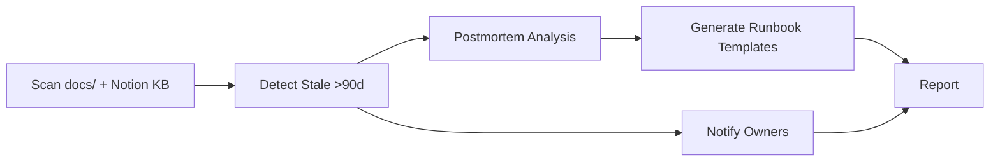

# Docs Freshness Guardian

## Output language

All outputs MUST be in Korean (한국어). Technical terms may remain in English.

## Overview
Scheduled pipeline that scans docs/ and Notion KB for stale documents (unchanged >90 days), reminds owners, auto-generates runbook templates from recent postmortems, and detects undocumented verbal decisions from meeting logs.

## Autonomy Level
**L4** — Fully autonomous scheduled run; human receives reminders and approves runbook generation.

## Pipeline Architecture
Sequential: scan → detect stale → notify owners → generate runbooks from postmortems → report.

### Mermaid Diagram


## Trigger Conditions
- Cursor Automation schedule (e.g., weekly)
- Phrases such as "docs freshness", "stale doc check", "runbook generation" (see YAML `description` for Korean triggers)
- `/docs-freshness-guardian` command

## Skill Chain
| Step | Skill | Purpose |
|------|-------|---------|
| 1 | technical-writer | Runbook template structure |
| 2 | cognee | Cross-reference postmortems, existing runbooks |
| 3 | md-to-notion | Create runbook drafts, update KB |
| 4 | kwp-engineering-documentation | Documentation standards |
| 5 | codebase-archaeologist | Detect undocumented decisions from git/meeting history |

## Output Channels
- **Slack**: Stale doc reminders to owners, runbook generation summary
- **Notion**: Runbook draft pages, freshness report
- **Email**: Optional owner notifications via gws-gmail

## Configuration
- Stale threshold: 90 days
- `NOTION_KB_PARENT_ID`: Knowledge base root
- `docs/` path: Local documentation directory
- Postmortem source: Notion incident DB or `output/` directory

## Example Invocation
```
/docs-freshness-guardian
"Run docs freshness check"
```
