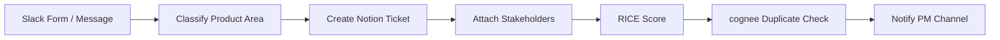

# Feature Intake Router

## Overview
Automates the intake of feature requests from Slack forms or messages. Classifies requests by product area, creates structured Notion tickets with stakeholder mapping, suggests RICE priority scores, detects duplicates via knowledge graph, and notifies the PM channel.

## Autonomy Level
**L3** — Semi-autonomous; human approves classification and priority before ticket creation in ambiguous cases.

## Pipeline Architecture
Sequential: Slack form intake → classify → Notion ticket → stakeholder attach → RICE score → duplicate check → notify PM channel.

### Mermaid Diagram


## Trigger Conditions
- Slack form submission (feature request)
- "feature intake", "기능 요청 접수", "request routing"
- `/feature-intake-router` with request text

## Skill Chain
| Step | Skill | Purpose |
|------|-------|---------|
| 1 | kwp-product-management-feature-spec | Parse and structure feature request |
| 2 | kwp-product-management-roadmap-management | RICE scoring, prioritization |
| 3 | md-to-notion | Create Notion ticket with properties |
| 4 | cognee | Semantic duplicate detection across existing tickets |

## Output Channels
- **Notion**: New ticket in feature request database
- **Slack**: Notification to PM channel with ticket link and summary

## Configuration
- `NOTION_FEATURE_DB_ID`: Database for feature tickets
- `SLACK_PM_CHANNEL_ID`: Channel for intake notifications
- Slack form field mapping: title, description, requester, source

## Example Invocation
```
"Feature intake: [paste request from Slack]"
"기능 요청 접수해줘"
"Route this feature request to Notion"
```
