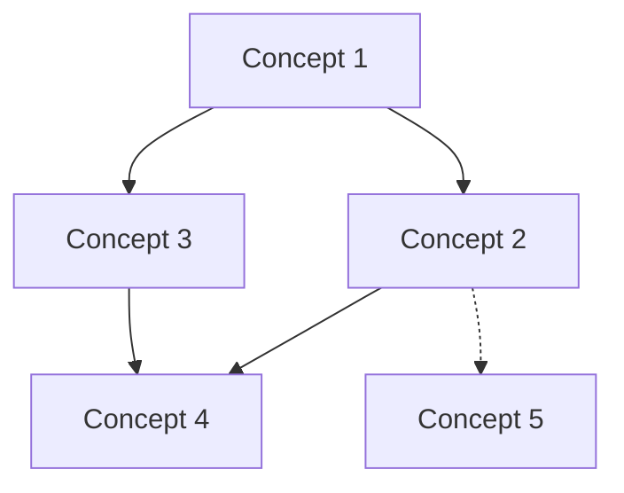

# KB Compile — Wiki Builder from Raw Sources

Transform raw source material into a structured, interconnected markdown wiki. The LLM reads all raw documents, identifies concepts, writes comprehensive articles, creates cross-references, and maintains navigational indexes — all automatically.

## Core Principle

**The wiki is the domain of the LLM.** Humans contribute raw sources; the LLM owns the wiki entirely. Every article, index, and link is generated and maintained by the compiler.

## Prerequisites

- Raw sources must exist in `knowledge-bases/{topic}/raw/`
- At least one source document is required
- `manifest.json` must exist (created by kb-ingest)

## Wiki Directory Structure

```
knowledge-bases/{topic}/wiki/
├── _index.md               # Master index: all articles with one-line summaries
├── _summary.md             # Topic-level executive summary
├── _concept-map.md         # Visual concept relationship map (Mermaid)
├── _glossary.md            # Key terms and definitions
├── concepts/               # Core concept articles
│   ├── {concept-1}.md
│   ├── {concept-2}.md
│   └── ...
├── references/             # Source-derived reference articles
│   ├── {source-1}-notes.md
│   └── ...
├── connections/            # Cross-concept synthesis articles
│   ├── {topic-a}-vs-{topic-b}.md
│   └── ...
└── images/                 # Generated diagrams and charts
    └── ...
```

## Workflow

### Step 1: Survey Raw Sources

Read `manifest.json` to get the source inventory. Then read each raw file, building a mental model of:

- Key concepts mentioned across sources
- Relationships between concepts
- Areas of agreement and disagreement
- Gaps in coverage

### Step 2: Plan Wiki Structure

Based on the survey, plan the wiki structure:

1. **Identify 10-30 core concepts** that appear across multiple sources
2. **Group into categories** (if the topic warrants subcategories)
3. **Identify connections** — concepts that bridge or contrast
4. **Note gaps** — important subtopics not covered by raw sources

Write the plan to a temporary `_compile-plan.md` (deleted after compilation).

### Step 3: Generate Concept Articles

For each identified concept, write a wiki article following this template:

```markdown
---
title: "Concept Name"
category: "concepts"
related: ["concept-2", "concept-3"]
sources: ["raw/source-1.md", "raw/source-2.md"]
last_compiled: "2026-04-03"
word_count: 850
---

# Concept Name

[2-3 sentence definition and significance]

## Overview

[Comprehensive explanation synthesized from multiple sources]

## Key Details

[Technical details, mechanisms, important nuances]

## Connections

- **Related to [[concept-2]]**: [how they relate]
- **Contrasts with [[concept-3]]**: [key differences]
- **Builds on [[concept-4]]**: [dependency relationship]

## Sources

- [Source Title 1](../raw/source-1.md) — [what this source contributes]
- [Source Title 2](../raw/source-2.md) — [what this source contributes]
```

### Step 4: Generate Reference Notes

For each raw source, create a reference note summarizing the key takeaways:

```markdown
---
title: "Notes: {Source Title}"
category: "references"
source: "raw/{slug}.md"
concepts_mentioned: ["concept-1", "concept-2"]
last_compiled: "2026-04-03"
---

# Notes: {Source Title}

**Source:** [{title}]({url})
**Author:** {author} | **Date:** {date}

## Key Takeaways

1. [Major point 1]
2. [Major point 2]
3. [Major point 3]

## Concepts Covered

- **[[concept-1]]**: [how this source discusses it]
- **[[concept-2]]**: [how this source discusses it]

## Notable Quotes

> "Direct quote from source" — {author}

## Open Questions

- [Question raised but not fully answered]
```

### Step 5: Generate Connection Articles

For notable cross-concept relationships:

```markdown
---
title: "{Concept A} vs {Concept B}"
category: "connections"
concepts: ["concept-a", "concept-b"]
last_compiled: "2026-04-03"
---

# {Concept A} vs {Concept B}

[Analysis of the relationship, comparison, or synthesis]
```

### Step 6: Build Index Files

**`_index.md`** — Master index:

```markdown
# {Topic} Knowledge Base

> Compiled from {N} sources | {M} articles | ~{W}K words
> Last compiled: {date}

## Concepts

| Article | Summary | Sources |
|---------|---------|---------|
| [[concept-1]] | One-line summary | 3 |
| [[concept-2]] | One-line summary | 2 |

## References

| Source | Key Concepts | Date |
|--------|-------------|------|
| [[source-1-notes]] | concept-1, concept-3 | 2026-01 |

## Connections

| Article | Bridging |
|---------|----------|
| [[concept-a-vs-concept-b]] | concept-a ↔ concept-b |
```

**`_summary.md`** — Executive summary (500-1000 words):

```markdown
# {Topic}: Executive Summary

[High-level overview of the entire knowledge base]

## Core Themes

1. [Theme 1]: [brief]
2. [Theme 2]: [brief]

## Key Insights

- [Insight that emerges from synthesizing multiple sources]

## Open Questions

- [Important unresolved questions]
```

**`_concept-map.md`** — Visual relationship map:

````markdown
# Concept Map


````

**`_glossary.md`** — Key terms:

```markdown
# Glossary

| Term | Definition | See Also |
|------|-----------|----------|
| Term 1 | Brief definition | [[concept-1]] |
```

### Step 7: Update Manifest

Update `manifest.json` with wiki stats:

```json
{
  "stats": {
    "raw_count": 15,
    "wiki_articles": 28,
    "total_words": 42000,
    "last_compiled": "2026-04-03",
    "concepts": 18,
    "references": 15,
    "connections": 5
  }
}
```

### Step 8: Report

```
✓ Wiki compiled for: {topic}
  Concepts: {N} articles
  References: {M} source notes
  Connections: {C} synthesis articles
  Total words: ~{W}K
  Index files: _index.md, _summary.md, _concept-map.md, _glossary.md
```

## Incremental Compilation

When new raw sources are added after initial compilation:

1. Read only the new/modified raw sources
2. Identify new concepts or updates to existing ones
3. Update affected articles (preserve existing content, augment)
4. Regenerate index files
5. Update `_concept-map.md` with new relationships

**Never delete existing wiki articles** during incremental compilation unless the user explicitly requests a full recompile.

## Cross-Reference Syntax

Use wiki-style links for internal references:

- `[[concept-name]]` — link to concept article
- `[[source-notes]]` — link to reference notes
- `[text](../raw/source.md)` — link to raw source

## Examples

### Example 1: Initial compilation

**User says:** "Compile the transformer-architectures KB"

**Actions:**
1. Read all files in `knowledge-bases/transformer-architectures/raw/`
2. Identify concepts: attention mechanism, positional encoding, multi-head attention, etc.
3. Generate ~15 concept articles, ~10 reference notes, ~5 connection articles
4. Build all index files
5. Update manifest

### Example 2: Incremental update

**User says:** "I added 3 new papers to the KB, recompile"

**Actions:**
1. Compare manifest sources vs raw/ directory to find new files
2. Read only new sources
3. Update existing articles where new data applies
4. Create new articles for new concepts
5. Regenerate index files

## Obsidian Compatibility

Compiled wiki articles use `[[wikilinks]]` for cross-references, which render natively in Obsidian. The `knowledge-bases/` vault includes pre-configured Graph View color groups — see `knowledge-bases/OBSIDIAN_SETUP.md`.

## Error Handling

| Error | Symptom | Action |
|-------|---------|--------|
| No raw sources | Empty raw/ directory | Prompt user to run kb-ingest first |
| Source too large | Single raw file > 100K words | Split processing, use SemanticSearch within file |
| Concept ambiguity | Same term means different things in different sources | Create disambiguation article |
| Circular references | Concepts reference each other in loops | Acceptable — ensure backlinks are consistent |
