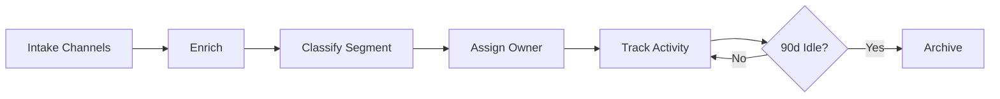

# Lead Lifecycle Manager

## Overview
End-to-end lead management pipeline that registers leads from email, Slack, and events, enriches them with web research, classifies by segment, assigns owners, tracks dormancy, and auto-archives leads inactive for 90 days.

## Autonomy Level
**L3** — Semi-autonomous; human approves owner assignment and archive decisions for high-value leads.

## Pipeline Architecture
Sequential: intake → enrich → classify → assign → track → archive.

### Mermaid Diagram


## Trigger Conditions
- New lead from email, Slack, or event registration
- "lead lifecycle", "리드 관리", "new lead intake", "dormant leads"
- `/lead-lifecycle-manager` with lead data

## Skill Chain
| Step | Skill | Purpose |
|------|-------|---------|
| 1 | kwp-sales-account-research | Research company and contact |
| 2 | kwp-apollo-enrich-lead | Enrich with Apollo data |
| 3 | kwp-apollo-prospect | Segment classification, ICP matching |
| 4 | md-to-notion | Create/update lead record in Notion CRM |
| 5 | cognee | Semantic deduplication, relationship tracking |

## Output Channels
- **Notion**: Lead record with enrichment, segment, owner, last activity
- **Slack**: Notification on new lead, dormancy alert before archive

## Configuration
- `NOTION_LEAD_DB_ID`: CRM database for leads
- Dormancy threshold: 90 days
- Intake webhook URLs for email, Slack, events

## Example Invocation
```
"Register new lead: [company name, contact]"
"리드 관리 파이프라인 실행"
"Check dormant leads"
```
