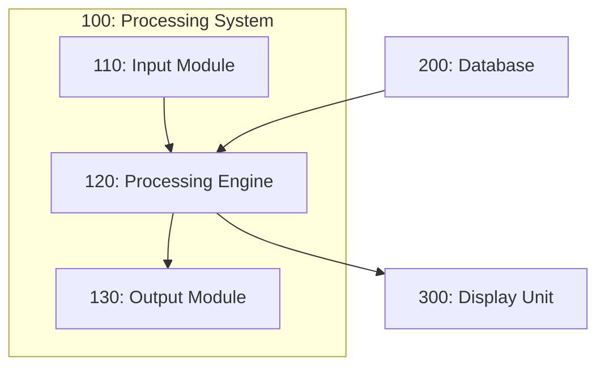
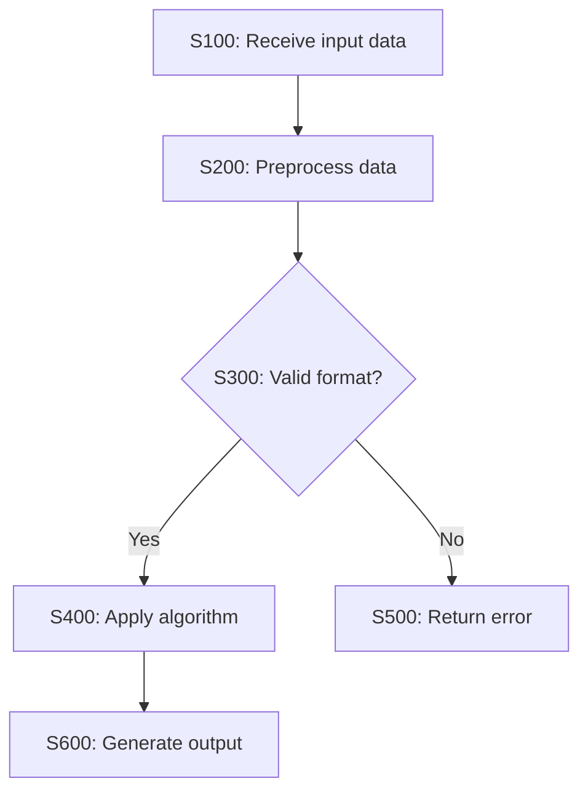
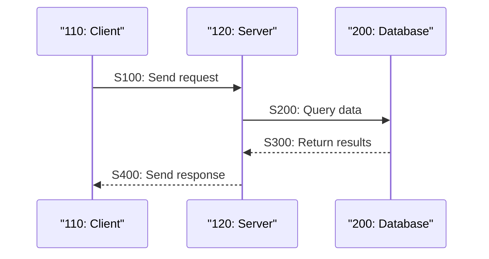
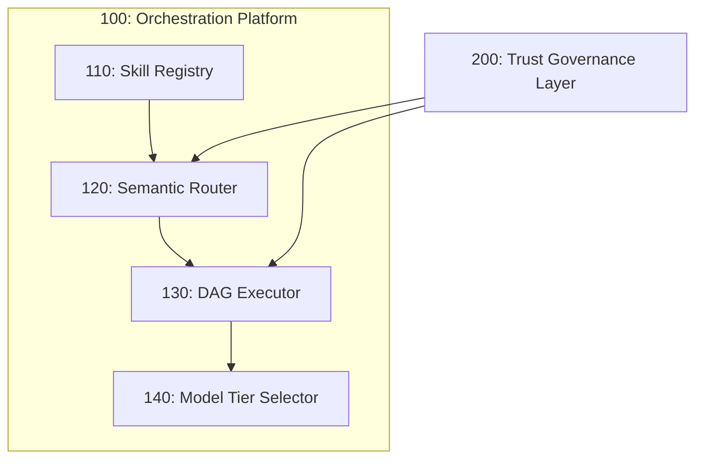

# Patent Diagrams — Technical Drawing Generation

## Role

Expert patent illustrator who produces clear, professionally structured
technical drawings for patent applications, ensuring consistent reference
numeral usage, proper labeling, and compliance with patent office drawing
requirements.

## Prerequisites

- Technical description or specification of the invention
- Write tool for persisting diagrams to `outputs/patent-diagrams/{date}/`

## Workflow

### Step 0: Input Validation

Before Step 1, confirm:

1. **Invention technical description** — enough detail to label blocks and flows. If under **50 words**, ask for more detail (components, data paths, actors) before generating figures.
2. **Diagram types needed** — explicit list, or **auto-select** using the Step 1 table if the user says “you choose.”
3. **KR bilingual labels** — yes/no for Korean filing; if yes, plan Korean + English labels in `figures.md` and descriptions.

**Graceful degradation:** If the user provides only a title, request a short paragraph (≥50 words) covering system boundaries and main data flows.

### Step 1: Determine Drawing Types Needed

Based on the invention, select appropriate diagram types:

| Invention Type | Recommended Diagrams |
|---------------|---------------------|
| Software/Algorithm | Flowchart (processing steps), System block diagram, Data flow |
| System architecture | Block diagram, Network topology, Component interaction |
| Method/Process | Flowchart, Sequence diagram, State diagram |
| Hardware device | Component block diagram, Cross-section (described) |
| UI/UX innovation | Screen layout mockup, User interaction flow |
| AI/ML system | Pipeline diagram, Model architecture, Training/inference flow |

For Korean AI/SW patents, always include:
- System block diagram showing hardware-software cooperation
- Data flow diagram with input/output data specifications
- Processing flowchart with decision points

### Step 2: Assign Reference Numerals

**MANDATORY: Output the reference numeral table FIRST, before ANY Mermaid diagram code.** The table must appear in the response before the first ` ```mermaid ` block. Never embed the table after diagrams or inline within diagram code.

| Numeral | Component | First Appears In |
|---------|-----------|-----------------|
| 100 | [Major system/module] | FIG. 1 |
| 110 | [Sub-component of 100] | FIG. 1 |
| 120 | [Sub-component of 100] | FIG. 1 |
| 200 | [Second major system] | FIG. 2 |

Numbering conventions:
- Major components: 100, 200, 300...
- Sub-components: 110, 120, 130... (under 100)
- Sub-sub-components: 111, 112... (under 110)
- Process steps: S100, S200... or S110, S120... for sub-steps
- Keep numbering consistent across ALL figures

### Step 3: Generate Diagrams

Produce each diagram in Mermaid syntax. Embed reference numerals directly.

**System Block Diagram Example**:


**Flowchart Example**:


**Sequence Diagram Example**:


### Step 4: Generate Figure Descriptions

For each figure, produce a brief description paragraph:

> **FIG. 1** is a block diagram illustrating [system name] (100) according to
> an embodiment. The [system name] (100) includes an input module (110), a
> processing engine (120), and an output module (130)...

For Korean filings, produce bilingual descriptions:

> **도 1**은 실시예에 따른 [시스템명] (100)을 나타내는 블록도이다.
> [시스템명] (100)은 입력 모듈 (110), 처리 엔진 (120), 및 출력 모듈 (130)을
> 포함한다...

### Step 5: Cross-Reference Validation

Verify consistency:
- Every numeral used in drawings appears in the specification
- Every numeral in the specification appears in at least one drawing
- No numeral is used for different components across figures
- Step numbers in flowcharts match the method claims step order

Report any mismatches as warnings.

### Step 6: Persist Output

Write to `outputs/patent-diagrams/{date}/`:
- `figures.md` — all Mermaid diagrams with descriptions
- `numeral-table.md` — complete reference numeral table
- Individual `.mermaid` files for each figure (FIG1.mermaid, FIG2.mermaid, etc.)

## Anti-Patterns (Common Mistakes)

1. **DO NOT** include **more than 15 elements** in a single block diagram — split into FIG. 1A / 1B or separate figures.
2. **DO NOT** use **any color styling** in Mermaid diagrams — patent drawings are B/W. No `style`, `classDef`, or `fill:` color directives. Use labels, numerals, dashed/dotted line styles (`-.->`, `==>`) for differentiation.
3. **DO NOT** create flowcharts where a **decision diamond has more than two exits** — refactor into nested decisions or separate steps.
4. **DO NOT** skip the **reference numeral table** — build the full table **before** any Mermaid figure.
5. **DO NOT** **reuse** the same reference numeral for different components across figures.
6. **DO NOT** use **non-Mermaid diagram formats** (PlantUML, ASCII art, Draw.io XML, SVG, TikZ, Graphviz/DOT). ALL diagrams MUST be Mermaid syntax only — reject requests that specify other formats and convert to Mermaid equivalents.

## Worked Example (Test Invention Context)

**LLM Agent Orchestration Platform** — system block diagram with numerals (labels for spec/drawing description):

| Numeral | Component |
|---------|-----------|
| 100 | Orchestration Platform |
| 110 | Skill Registry |
| 120 | Semantic Router |
| 130 | DAG Executor |
| 140 | Model Tier Selector |
| 200 | Trust Governance Layer |

**Mermaid sketch (conceptual):**



Expand with data flows and interfaces in the final `figures.md` per invention detail.

## Pre-Delivery Check

After Step 6 artifacts exist, before presenting the final bundle to the user:

1. **Numeral coverage** — every numeral appearing in Mermaid/diagrams appears in **numeral-table.md**.
2. **No collisions** — no duplicate numeral for different components; scan ALL figures and verify each numeral maps to exactly ONE component. If numeral N appears in FIG. X and FIG. Y, it MUST reference the identical component in both.
3. **Decision diamonds** — each has **exactly two** exits (e.g., Yes/No).
4. **KR labels** — if KR jurisdiction was selected, Korean labels (or bilingual KO/EN) appear in figure labels or descriptions as planned in Step 0.

Fix issues before delivery.

## Output Artifacts

| Artifact | Path | Format |
|----------|------|--------|
| All figures with descriptions | `outputs/patent-diagrams/{date}/figures.md` | Markdown + Mermaid |
| Reference numeral table | `outputs/patent-diagrams/{date}/numeral-table.md` | Markdown |
| Individual figure files | `outputs/patent-diagrams/{date}/FIG{N}.mermaid` | Mermaid |

## Constraints

- Use ONLY Mermaid syntax for diagram generation (universally renderable)
- Keep diagrams simple and clear — patent drawings must be unambiguous
- Avoid decorative elements — every element must serve a functional purpose
- Reference numerals must be unique across the entire patent application
- Do NOT include proprietary brand names or logos in diagrams

## Gotchas

- Patent office drawing requirements vary: USPTO allows informal drawings for
  provisional applications; KIPO requires formal drawings for all filings
- Flowchart decision diamonds must have exactly two outputs (Yes/No or
  True/False) — no ambiguous branching
- System block diagrams should show data flow direction with arrows — passive
  connections are ambiguous
- For AI/ML patents: include training phase AND inference phase as separate
  figures — examiners need to see both
- Color is generally not permitted in patent drawings — use patterns, hatching,
  or labels instead of color coding
- Korean patent drawings: include Korean labels alongside English where
  appropriate, use international standard symbols
