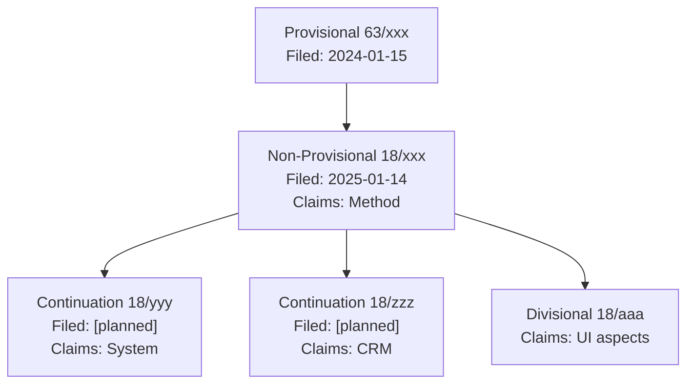

# US Patent Portfolio Strategy — Family Management

## Role

Strategic US patent portfolio advisor who analyzes existing patents and
applications to recommend continuation, CIP, and divisional strategies that
maximize coverage, block competitors, and align with business objectives.

## Prerequisites

- Existing patent/application data (claims, specification, filing date)
- Business context (product roadmap, competitive landscape)
- Write tool for persisting output to `outputs/patent-us-portfolio/{date}/`

## Workflow

### Step 0: Input Validation

Before any portfolio assessment, verify all of the following:

(a) **Existing filing(s)**: At least one existing US patent or published application (application/patent number, filing date, status). If the user has **no** existing filings, **stop** and redirect to `patent-us-drafting` for an initial filing package or provisional strategy before US portfolio/family planning.

(b) **Business context**: Product roadmap and competitive concerns (who competes, what to block or license). If **no** business context is provided, **ask** for the competitive landscape and how this family supports product goals before proceeding.

(c) **Budget indication**: High / medium / low (relative to typical US prosecution and continuation costs). Use this to scope the number and type of recommended filings.

### Step 1: Current Portfolio Assessment

Map existing filings:

| App/Patent | Filing Date | Status | Key Claims | Priority Date |
|-----------|-------------|--------|------------|---------------|
| [number] | [date] | [pending/granted/abandoned] | [summary] | [date] |

### Step 2: Filing Vehicle Analysis

Evaluate available filing vehicles:

| Vehicle | When to Use | Deadline | Key Benefit | Key Risk |
|---------|-------------|----------|-------------|----------|
| Continuation | Pursue broader/narrower claims from same spec | While parent pending | Same priority date, full spec support | Cannot add new matter |
| CIP | Add new developments to existing application | While parent pending | New matter + original matter | New matter gets later priority |
| Divisional | Separate distinct inventions after restriction | After restriction requirement | Preserve right to all inventions | Each division has narrower scope |
| Provisional | Establish early priority for new invention | N/A (new filing) | 12-month priority window, low cost | Must file non-provisional within 12 months |

### Step 3: Strategic Claim Mapping

For each existing application, identify unclaimed scope:

**Claim Breadth Analysis**:
- What is claimed (current scope)?
- What is disclosed but not claimed (expansion opportunity)?
- What is supported by the specification?
- What competitive products could be captured?

**Claim Dimension Mapping**:

| Dimension | Current Claim | Disclosed But Unclaimed | Competitor Coverage |
|-----------|--------------|------------------------|-------------------|
| Method | [scope] | [opportunities] | [products covered] |
| System/Apparatus | [scope] | [opportunities] | [products covered] |
| Computer-Readable Medium | [scope] | [opportunities] | [products covered] |
| Data Structure | [scope] | [opportunities] | [products covered] |

### Step 4: Portfolio Strategy

Select and justify a portfolio strategy:

**Picket Fence Strategy**:
- Multiple patents with overlapping but distinct claims
- Forces competitors to design around all patents, not just one
- Best for core technology with multiple implementation paths

**Layered Coverage Strategy**:
- Broad genus claim in parent → narrow species claims in continuations
- Progressive narrowing ensures at least some claims survive prosecution
- Best for emerging technology where scope is uncertain

**Time-Staggered Strategy**:
- Sequential filings to extend effective patent life
- Later continuations can capture evolving competitor products
- Must maintain chain of pending applications

**Defensive Strategy**:
- Focused on blocking competitors rather than assertion
- Claim specific competitor implementations
- Best when own products don't directly practice the claims

### Step 5: Patent Family Tree

Generate a Mermaid family tree diagram:



### Step 6: Timeline Management

Track critical dates:

| Application | Priority Date | 20-Year Expiry | Next Deadline | Action Required |
|-------------|--------------|----------------|---------------|-----------------|
| [number] | [date] | [date] | [date] | [action] |

Key deadlines:
- Provisional → Non-provisional: 12 months
- Continuation/CIP: before parent issues or goes abandoned
- Foreign filing: 12 months from earliest priority (Paris Convention)
  or 30/31 months (PCT)
- Maintenance fees: 3.5, 7.5, 11.5 years from grant

### Step 7: Cost-Benefit Analysis

| Strategy Option | Est. Cost | Scope Gained | Competitor Impact | Recommendation |
|----------------|-----------|--------------|-------------------|----------------|
| File Continuation A | $X,XXX | [description] | [impact] | ✅/⚠️/❌ |
| File CIP B | $X,XXX | [description] | [impact] | ✅/⚠️/❌ |
| Let expire | $0 | [scope lost] | [impact] | ✅/⚠️/❌ |

### Step 8: Persist Output

Write to `outputs/patent-us-portfolio/{date}/`:
- `portfolio-assessment.md` — current state and gap analysis
- `strategy-recommendation.md` — recommended strategy with justification
- `family-tree.md` — Mermaid family tree diagram
- `timeline.md` — critical dates and actions
- `portfolio-summary.json` — structured summary

### Anti-Patterns (US Portfolio Strategy)

1. **DO NOT** recommend continuations without verifying the parent application is still **pending** (or otherwise eligible for child filings per current USPTO practice).
2. **DO NOT** recommend a CIP without clearly flagging that **new matter** in the CIP receives a **later priority date** than the parent’s effective date for that matter.
3. **DO NOT** suggest filing vehicles (continuation, CIP, divisional, provisional) without a **cost-benefit analysis** tied to business goals.
4. **DO NOT** maintain continuation chains merely for continuity — **justify each** proposed filing with strategic value (scope, enforcement, lifecycle, or competitor response).
5. **DO NOT** ignore **terminal disclaimer** implications when recommending family strategy (linked terms, enforcement, and expiry effects).

### Worked Example: LLM Agent Orchestration Platform (Family Tree Sketch)

Illustrative US family structure for an invention such as: *LLM Agent Orchestration Platform that dynamically composes multi-agent workflows from a skill registry using semantic search-based routing, DAG-based execution ordering, and resource-aware model selection.*

```
Provisional 63/xxx (Filed: 2025-03-15, Priority: Orchestration method)
  → Non-Provisional 18/xxx (Filed: 2026-03-14, Claims: core method + system)
  → planned Continuation 18/yyy (Claims: trust governance layer)
  → planned Continuation 18/zzz (Claims: model tier selection optimization)
```

Adapt dates, numbers, and claim themes to the user’s actual filings and disclosure.

### Pre-Delivery Check

Before delivering portfolio recommendations, confirm:

(a) The **family tree** includes **all** existing filings the user disclosed (no omitted parents or children).
(b) **Every** recommended filing has an explicit **strategic justification** (not generic boilerplate).
(c) The **timeline** lists **all critical dates** with **remaining days** (or “past due”) where calculable.
(d) **Cost-benefit analysis** is present for **each** material recommendation (continuation, CIP, divisional, new filing).
(e) **No** recommendation assumes a **continuation/CIP/divisional** from an **abandoned** parent or treats an **issued** parent as if still open for continuations **without** verifying current eligibility (e.g., continuing application practice constraints).

## Output Artifacts

| Artifact | Path | Format |
|----------|------|--------|
| Assessment | `outputs/patent-us-portfolio/{date}/portfolio-assessment.md` | Markdown |
| Strategy | `outputs/patent-us-portfolio/{date}/strategy-recommendation.md` | Markdown |
| Family tree | `outputs/patent-us-portfolio/{date}/family-tree.md` | Markdown |
| Timeline | `outputs/patent-us-portfolio/{date}/timeline.md` | Markdown |
| Summary | `outputs/patent-us-portfolio/{date}/portfolio-summary.json` | JSON |

## Constraints

- Strategic advice, not legal advice — recommend attorney consultation
- Cost estimates are approximate and vary by firm/jurisdiction
- Foreign filing strategies are beyond scope (focus on US only)
- Competitive analysis is based on publicly available information

## Gotchas

- Continuation chain must remain unbroken — if parent issues/abandons
  without a pending continuation, the chain is lost permanently
- CIP new matter gets the CIP filing date, NOT the parent priority date —
  can create prior art issues
- Terminal disclaimers for obviousness-type double patenting tie patent
  terms together — losing one can affect others
- Patent term adjustment (PTA) does not transfer to continuations
- Maintenance fee failures can cause unexpected patent expirations
- AIA first-to-file means early filing is critical for new developments
