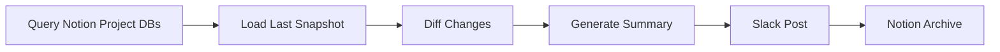

# Planning Weekly Pulse

## Overview
Scheduled weekly pipeline that queries Notion project databases, diffs against the previous week's snapshot, generates a "what changed this week" summary, posts to Slack, and archives the report in Notion for historical reference.

## Autonomy Level
**L4** — Fully autonomous weekly automation; no human-in-loop for routine runs.

## Pipeline Architecture
Sequential: Notion DB query → diff snapshot → generate summary → Slack post → Notion archive.

### Mermaid Diagram


## Trigger Conditions
- Cursor Automation schedule (weekly, e.g., Monday 9am)
- "weekly pulse", "주간 현황", "what changed this week"
- `/planning-weekly-pulse` command

## Skill Chain
| Step | Skill | Purpose |
|------|-------|---------|
| 1 | kwp-product-management-stakeholder-comms | Format summary for stakeholder consumption |
| 2 | visual-explainer | Generate change visualization if needed |
| 3 | anthropic-docx | Optional: formatted report document |
| 4 | md-to-slack-canvas | Post summary to Slack Canvas or channel |

## Output Channels
- **Slack**: Weekly pulse message with key changes, links to Notion
- **Notion**: Archived pulse report page for historical reference

## Configuration
- `NOTION_PROJECT_DB_IDS`: List of project database IDs to query
- `NOTION_PULSE_ARCHIVE_PAGE_ID`: Parent page for archived reports
- `SLACK_PLANNING_CHANNEL_ID`: Target channel for pulse post
- Snapshot storage: local JSON or Notion property

## Example Invocation
```
/planning-weekly-pulse
"Run weekly pulse"
"주간 현황 생성해줘"
```
