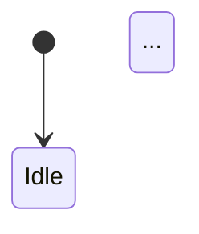

# Structured planning document template (reverse-engineered from code)

**Fill all user-facing prose in Korean.** Keep technical identifiers (paths, types, HTTP verbs, class names) in English where standard.

## Inference and evidence tags

- `[사실]` — Directly observable from code or demo
- `[추론]` — Inferred intent from patterns
- `[추론 불가]` — Cannot infer product intent from artifacts
- `[확인 필요]` — Ambiguous; planner must confirm
- `[미확인]` — Could not access code path to verify

---

## Document skeleton (copy below)

```markdown
# Reverse spec: {feature or module name}

**Generated:** YYYY-MM-DD
**Sources:** {paths, PR URL, or demo notes}
**Scope:** {scope} ({file count} files)

---

## 1. Overview

### Feature summary
- {bullet list of capabilities}

### Architecture / module map
{optional mermaid flow or component graph}

---

## 2. User scenarios & flows

### Happy path
{steps}

### Alternate paths
{steps}

### Screen flow (frontend only)
{routes, navigation, or mermaid diagram}

---

## 3. State matrix & diagrams

### State transition diagram


### State matrix

| State | Entry condition | UI / system behavior | User actions | Next states |
|-------|-----------------|----------------------|--------------|-------------|

### State table (compact, optional)

| State | Code value | Transition condition | Next state | Code ref |
|-------|------------|----------------------|------------|----------|

---

## 4. Edge cases

### Observed handling

| # | Scenario | Handling | Code ref | Severity |
|---|----------|----------|----------|----------|

### Suspected gaps (not handled in code)

| # | Scenario | Why it matters | Suggested handling | Evidence |
|---|----------|----------------|--------------------|----------|

---

## 5. Business rules

| # | Rule | Condition | Action | Code ref | Policy ref |
|---|------|-----------|--------|----------|------------|

---

## 6. API specification

### Endpoint index

| Method | Path | Description | Auth | Code ref |
|--------|------|-------------|------|----------|

### {METHOD} {path}

**Summary:** {one line}

**Request**

| Parameter | Type | Required | Validation | Description |
|-----------|------|----------|------------|-------------|

**Response**

| Field | Type | Description |
|-------|------|-------------|

**Status codes**

| Code | Condition | Response / body |
|------|-----------|-----------------|

**Errors (app-level)**

| Code / key | When | User-visible message |
|------------|------|----------------------|

**State transition (if any)**
{before} → {after} when {trigger}

---

## 7. Data model

| Entity | Field | Type | Description | Code ref |
|--------|-------|------|-------------|----------|

---

## 8. Policy mapping (if policy docs provided)

| Policy | Requirement | Implementation | Status |
|--------|-------------|----------------|--------|

Status: 반영됨 / 부분 반영 / 미반영

---

## 9. Planning gaps (from code perspective)

### Unclear product intent in code

| # | Item | Code ref | Question for planners |
|---|------|----------|------------------------|

### Inference log

| # | Item | Basis | Confidence |
|---|------|-------|--------------|

---

## 10. Quick spec alignment (optional, lightweight)

If a draft spec was provided—not a full comparator audit:

| # | Topic | Spec says | Code does | Severity | Notes |
|---|-------|-----------|-----------|----------|-------|

---

## 11. Open questions

| # | Topic | Code ref | Question |
|---|-------|----------|----------|

---

*Auto-generated from code. Items tagged `[확인 필요]` require planner review.*
```

## Quality checklist

- At least one **state** artifact (table or diagram) when states exist in code
- **File:line** (or demo note) for non-trivial claims
- Section **Planning gaps** or **Open questions** must not be empty: use “None found” if truly nothing
