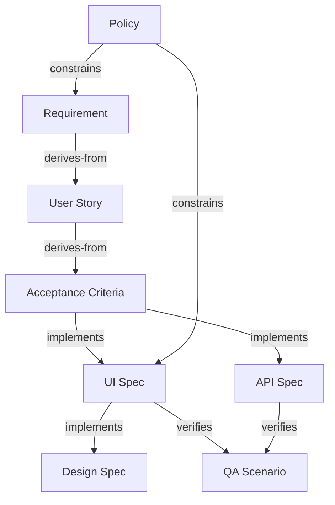

# PRD Pipeline Node Types

## Node Type Definitions

| Node Type | ID Prefix | Description | Typical Content |
|-----------|-----------|-------------|-----------------|
| requirement | REQ- | 비즈니스/기능 요구사항 | 목적, 범위, 제약조건 |
| user-story | US- | 유저 스토리 | As a [user], I want [goal], so that [benefit] |
| acceptance-criteria | AC- | 수용 기준 | Given-When-Then 또는 체크리스트 |
| ui-spec | UI- | UI/UX 스펙 | 화면 구성, 인터랙션 정의, 상태별 UI |
| design-spec | DES- | 디자인 스펙 | Figma 링크, 토큰, 컴포넌트 명세 |
| api-spec | API- | API 스펙 | 엔드포인트, 파라미터, 응답 포맷 |
| qa-scenario | QA- | QA 테스트 시나리오 | 테스트 케이스, 기대 결과, 전제 조건 |
| policy | POL- | 정책/규칙 | 비즈니스 규칙, 법적 요건, 운영 정책 |

## Default Dependency Graph

## Relationship Semantics

### derives-from
- 하류 노드가 상류 노드의 내용을 기반으로 작성됨
- 상류 변경 시 하류 재검토 필수
- 예: 요구사항 → 유저 스토리

### constrains
- 상류 노드가 하류 노드의 범위나 조건을 제한함
- 상류 변경 시 하류의 제약 조건 재검토
- 예: 정책 → 요구사항 (법적 요건이 기능 범위를 제한)

### implements
- 하류 노드가 상류 노드를 구체적으로 구현함
- 상류 변경 시 하류의 구현 방식 재검토
- 예: 수용 기준 → UI 스펙 (기준을 화면으로 구현)

### verifies
- 하류 노드가 상류 노드의 정합성을 검증함
- 상류 변경 시 하류의 검증 시나리오 재검토
- 예: UI 스펙 → QA 시나리오 (스펙 변경 시 테스트 케이스 수정)

## Impact Propagation Rules

1. `derives-from` 관계에서 상류 변경 → 하류 High impact
2. `constrains` 관계에서 상류 변경 → 하류 High impact (범위 변경)
3. `implements` 관계에서 상류 변경 → 하류 Medium~High impact
4. `verifies` 관계에서 상류 변경 → 하류 Medium impact (검증 기준 변경)
5. Depth 3 이상의 transitive 영향 → 기본 Low impact (직접 분석 후 조정)
