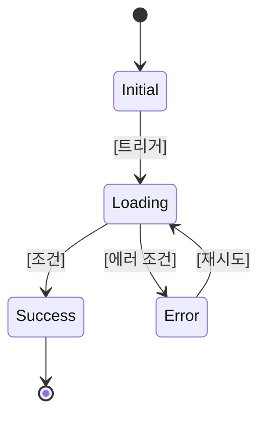

# State Matrix Template

## 기능: [기능명]

### 상태 전이 다이어그램

### 상태값 매트릭스

| # | 상태 | 진입 조건 | UI 표시 | 사용자 액션 | 전환 대상 | 비고 |
|---|------|----------|---------|------------|----------|------|
| 1 | 초기 (Initial) | 화면 최초 진입 | [기본 UI] | [가능한 액션] | [다음 상태] | |
| 2 | 로딩 (Loading) | [트리거 액션] | 스피너/스켈레톤 | 취소 (가능 여부) | 성공/실패 | |
| 3 | 성공 (Success) | API 응답 성공 | [성공 UI] | [후속 액션] | [다음 상태] | |
| 4 | 실패 (Error) | API 에러/타임아웃 | 에러 메시지 | 재시도/돌아가기 | 로딩/초기 | |
| 5 | 빈 상태 (Empty) | 데이터 0건 | 빈 상태 안내 | [생성 유도] | [다음 상태] | |
| 6 | 비활성 (Disabled) | 권한 없음/조건 미충족 | 비활성 UI | 없음 (안내 표시) | - | |

### 상태별 상세

#### [상태명]

- **진입 조건**: [구체적 조건]
- **UI 요구사항**: [화면에 표시할 내용]
- **사용자 인터랙션**: [사용자가 할 수 있는 것]
- **API 호출**: [이 상태에서 호출하는 API]
- **전이 규칙**: [다음 상태로 넘어가는 조건]
- **접근성**: [스크린리더, 키보드 등 고려사항]
