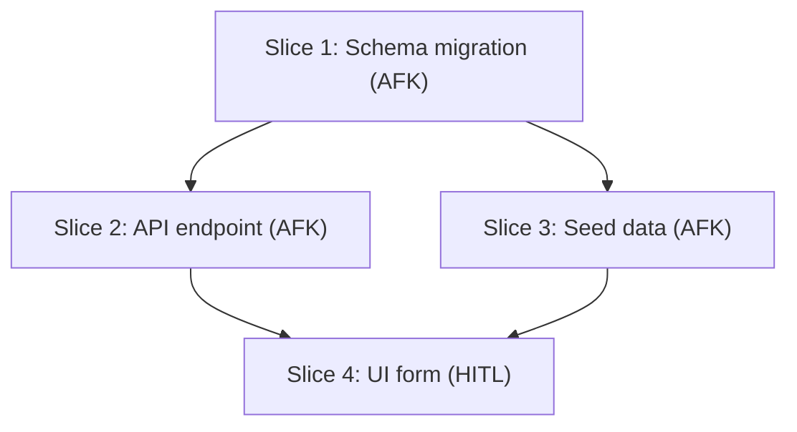

# Vertical-Slice Issue Decomposition

Break a plan, spec, or PRD into independently-grabbable GitHub issues using
tracer-bullet vertical slices that cut through ALL integration layers end-to-end.

## Process

### 1. Gather context

Work from whatever is already in the conversation. If the user passes a GitHub
issue number or URL, fetch it with `gh issue view <number>`.

### 2. Explore the codebase (optional)

If needed, explore to understand the current state.

### 3. Draft vertical slices

Break the plan into **tracer bullet** issues. Each is a thin vertical slice
cutting through ALL layers end-to-end, NOT a horizontal slice of one layer.

Classify each as:
- **AFK** — can be implemented and merged without human interaction (preferred)
- **HITL** — requires a human decision, architectural review, or design input

Rules:
- Each slice delivers a narrow but COMPLETE path through every layer (schema, API, UI, tests)
- A completed slice is demoable or verifiable on its own
- Prefer many thin slices over few thick ones

### 4. Quiz the user

Present the breakdown as a numbered list showing:
- **Title**: short descriptive name
- **Type**: HITL / AFK
- **Blocked by**: which other slices must complete first
- **User stories covered**: which stories this addresses (if applicable)

Ask:
- Does the granularity feel right?
- Are dependency relationships correct?
- Should any slices be merged or split?
- Are HITL/AFK classifications correct?

Iterate until the user approves.

### 5. Create GitHub issues

Create in dependency order (blockers first) using `gh issue create`:

```
## Parent
#<parent-issue-number> (if source was a GitHub issue)

## What to build
End-to-end behavior description, not layer-by-layer.

## Acceptance criteria
- [ ] Criterion 1
- [ ] Criterion 2
- [ ] Criterion 3

## Blocked by
- Blocked by #<number>
Or "None — can start immediately"
```

Do NOT close or modify any parent issue.

## Slice Classification

Each slice is classified as one of:

- **AFK** — can be implemented and merged without human interaction. Preferred
  for maximizing autonomous throughput.
- **HITL** — requires a human decision, architectural review, or design input
  before implementation can proceed.

If ANY subjective design choice is needed, classify as HITL even if the
implementation is straightforward.

## Mermaid DAG Output

After user approval and before creating issues, generate a Mermaid flowchart
showing the dependency DAG:



## Constraints

- Each slice must be a vertical cut through ALL layers, not a horizontal slice
  of one layer.
- Issues must be created in dependency order so blocker references use real
  issue numbers.
- Do NOT close or modify any parent issue when creating sub-issues.

## Gotchas

- Users often push for fewer, larger issues "for simplicity." Push back — thin
  vertical slices enable parallel work and clearer progress tracking. The
  overhead of many issues is lower than the overhead of blocked thick issues.
- AFK classification is optimistic by default. If the issue requires ANY
  subjective design choice, mark it HITL even if the implementation is
  straightforward.
- When the source is a GitHub issue, always link back to it with `## Parent` —
  but never modify the parent issue's content or status.
