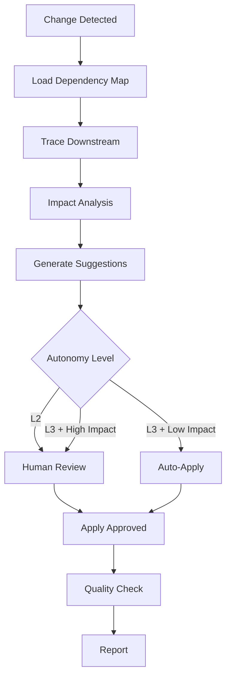

# PRD Cascade Sync

## Output language

All outputs MUST be in Korean (한국어). Technical terms may remain in English.

Monitor PRD pipeline nodes for changes and automatically propagate modifications to dependent downstream nodes. Implements change detection, dependency tracing, impact analysis, and semi-automatic update flows.

## Core Concepts

### PRD Pipeline as a DAG

A PRD is not a single document but a **directed acyclic graph (DAG)** of interconnected nodes. When one node changes, downstream nodes may become inconsistent. This skill automates the detection and resolution of those inconsistencies.

Node types and their relationships are defined in [references/node-types.md](references/node-types.md). The project-specific dependency map is configured in [references/dependency-map.json](references/dependency-map.json).

### Autonomy Levels

- **L2 (default)**: Generate modification suggestions → human approves → auto-apply
- **L3**: Low-impact changes auto-applied, high-impact changes require approval

## Instructions

### Step 1: Change Detection

Detect that a PRD node has changed. Three detection methods:

**Method A — User-Triggered** (most common):
The user explicitly states a change occurred (Korean phrasing in YAML triggers):
- e.g. requirement 3 changed
- e.g. checkout flow error handling changed
- e.g. `PRD cascade sync: [Notion URL]`

Extract: which node changed, what changed, the before/after diff.

**Method B — Notion Timestamp Comparison**:
Compare `last_edited_time` of tracked Notion pages against the last known state stored in `.cursor/skills/prd-cascade-sync/state/sync-state.json`:

```json
{
  "tracked_pages": {
    "page-id-1": {
      "title": "Checkout feature requirements",
      "node_type": "requirement",
      "last_synced": "2026-03-20T10:00:00Z",
      "notion_url": "https://notion.so/..."
    }
  },
  "last_scan": "2026-03-24T09:00:00Z"
}
```

Query each tracked page via Notion MCP. If `last_edited_time > last_synced`, flag as changed.

**Method C — Manual Diff Input**:
User provides before/after content directly.

### Step 2: Dependency Graph Resolution

Load the dependency map from [references/dependency-map.json](references/dependency-map.json) and trace all downstream nodes from the changed node.

**Traversal algorithm**:
1. Start from the changed node
2. Follow all outgoing edges (derives-from, constrains, implements, verifies)
3. Collect all reachable downstream nodes
4. Sort by topological order (closest dependencies first)
5. Assign depth level (1 = direct dependent, 2 = transitive, etc.)

```markdown
## Dependency Trace

Changed Node: [REQ-003] Add payment method requirement

| Depth | Node | Type | Relation | Impact |
|-------|------|------|----------|--------|
| 1 | US-007 | user-story | derives-from | High |
| 1 | US-008 | user-story | derives-from | High |
| 2 | AC-012 | acceptance-criteria | derives-from | High |
| 2 | AC-013 | acceptance-criteria | derives-from | Medium |
| 3 | UI-005 | ui-spec | implements | Medium |
| 3 | API-003 | api-spec | implements | High |
| 4 | QA-009 | qa-scenario | verifies | Medium |
```

### Step 3: Impact Analysis

For each downstream node, evaluate the change impact:

**High Impact** — Node content is directly invalidated:
- The changed upstream content is quoted or referenced verbatim
- The node's logic depends on the changed constraint
- The node implements the changed requirement

**Medium Impact** — Node may need review:
- The node references the changed area but not the specific content
- The change could affect edge cases the node addresses
- Related but not directly dependent

**Low Impact** — Node is tangentially related:
- The node is in the same feature area but different scope
- Cosmetic or naming changes that may need consistency update

### Step 4: Generate Modification Suggestions

For each impacted node (High and Medium), generate a concrete modification suggestion:

```markdown
## Modification Suggestions

### [US-007] Card checkout user story (Impact: High)

**Current**:
> As a shopper, I want to pay with a credit card, so that I can complete purchase quickly.

**Suggested Change**:
> As a shopper, I want to pay with a credit card or a wallet app, so that I can complete purchase quickly with my preferred method.

**Reason**: REQ-003 adds wallet payment; extend the story to cover the new method. (Deliver rationale in Korean per output rule.)

**Confidence**: 0.9
**Auto-apply eligible**: Yes (L3 mode)

---

### [AC-012] Successful payment acceptance criteria (Impact: High)

**Current**:
> After credit card payment succeeds, navigate to order confirmation.

**Suggested Change**:
> After credit card or wallet payment succeeds, navigate to order confirmation.
> For wallet payments, show confirmation after returning from the external wallet app.

**Reason**: Wallet checkout requires an explicit return path from the external app. (Deliver rationale in Korean per output rule.)

**Confidence**: 0.85
**Auto-apply eligible**: No (new flow, requires review)
```

### Step 5: Apply Updates

**L2 Mode (default)**:
1. Present all suggestions to the user in a structured table
2. User approves/rejects/modifies each suggestion
3. For approved suggestions:
   - Update Notion page content via Notion MCP
   - Update `sync-state.json` with new timestamps
   - Log changes to cascade history

**L3 Mode** (with `--auto` flag):
1. Auto-apply suggestions with confidence >= 0.9 AND impact != High
2. Queue High-impact and low-confidence suggestions for human review
3. Post summary of auto-applied changes to Slack

### Step 6: Post-Cascade Quality Check

After applying updates, run doc-quality-gate on all modified nodes to verify:
- No new inconsistencies introduced
- Terminology remains consistent
- Cross-references still valid

### Step 7: Report

Generate a cascade sync report:

```markdown
# Cascade Sync Report — YYYY-MM-DD

## Trigger
- Changed node: [node ID and title]
- Change summary: [what changed]

## Cascade Results
| Node | Type | Impact | Action | Status |
|------|------|--------|--------|--------|
| US-007 | user-story | High | Modified | Applied |
| AC-012 | acceptance-criteria | High | Modified | Pending approval |
| UI-005 | ui-spec | Medium | No change needed | Skipped |
| QA-009 | qa-scenario | Medium | Modified | Applied |

## Summary
- Downstream nodes analyzed: N
- Modifications suggested: M
- Auto-applied: A
- Pending approval: P
- No change needed: S
```

Post report to Notion and optionally to Slack.

## Pipeline



## Skill Chain

| Step | Skill | Purpose |
|------|-------|---------|
| 1 | Notion MCP | Fetch page content, detect changes, apply updates |
| 2 | dependency-radar | Provide dependency graph infrastructure |
| 3 | doc-quality-gate | Post-cascade quality verification |
| 4 | md-to-notion | Publish cascade report |
| 5 | Slack MCP | Notification and approval requests |

## Output Channels
- **Notion**: Cascade report + updated node pages
- **Slack**: Notification thread with approval buttons (L2), change summary (L3)
- **Local**: Report in `outputs/cascade-sync/`, state in `state/sync-state.json`

## Configuration
- `NOTION_PRD_PARENT_ID`: Parent page for PRD documents
- `SLACK_CASCADE_CHANNEL_ID`: Channel for cascade notifications
- Dependency map: `references/dependency-map.json`
- Autonomy level: L2 (default) or L3 (with `--auto` flag)

## Examples

### Example 1: Requirement change cascade

User says: "Requirement 3 changed — run cascade sync."

Actions:
1. Identify REQ-003 as changed node
2. Trace: 2 user stories, 3 acceptance criteria, 1 UI spec, 1 API spec, 2 QA scenarios
3. Impact: 4 high, 3 medium, 2 low
4. Generate 7 modification suggestions
5. Present to user for approval
6. Apply 5 approved, 2 deferred
7. Quality check: all clear
8. Report published to Notion

### Example 2: UI spec change with auto-apply

User says: "Auto-apply UI spec changes --auto"

Actions:
1. Detect UI-005 changed (button layout updated)
2. Trace: 2 QA scenarios, 1 design spec
3. Impact: all Medium
4. Auto-apply 3 suggestions (all confidence >= 0.9)
5. Post auto-apply summary to Slack

### Example 3: Scan for stale nodes

User says: "Check sync status for the whole PRD pipeline"

Actions:
1. Scan all tracked pages against sync-state.json
2. Find 3 pages modified since last sync
3. For each, trace and suggest cascading updates
4. Present consolidated report

## Error Handling

| Situation | Action |
|-----------|--------|
| Dependency map not found | Create a starter template and ask user to configure |
| Changed node not in dependency map | Ask user to add the node or provide manual dependency list |
| Notion page not accessible | Report access error, suggest page sharing |
| Circular dependency detected | Report cycle path, ask user to resolve before cascading |
| Conflicting suggestions | Present both options with trade-off analysis |
| Sync state file corrupted | Reset state, perform full scan |
