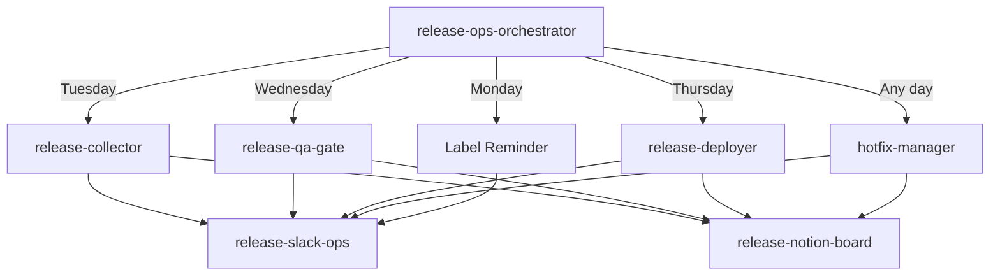

# Release Ops Orchestrator (Image Tagging Model)

Master orchestrator for the weekly release cycle using the 3-Label Release Gate System with immutable image promotion. PRs merged to `dev` trigger `dev-{TIMESTAMP}` image builds. Only `release:approved` PRs are included; the Release Owner re-tags the chosen `dev` image as `rc-{TIMESTAMP}` for QA, then promotes to `vYYYY.MM.DD` for production.

## When to Use

- As the primary entry point for release operations
- When the user invokes `/release-ops` without specifying a phase
- When status overview across the full cycle is needed
- When the system needs to determine which phase to run automatically

## Prerequisites

- All sub-skills installed
- GitHub CLI, Notion MCP, Slack MCP configured
- Rule file loaded: `.cursor/rules/release-ops-rules.mdc`
- GitHub labels exist: `release:approved`, `release:hold`, `release:blocked`, `hotfix`, `qa:needed`, `qa:done`, `risk:low`, `risk:medium`, `risk:high`

## Release Model Summary

**Image Tagging Model**: All PRs merge freely to `dev`, triggering `dev-{TIMESTAMP}` image builds on `ghcr.io`. App owners label their PRs with `release:approved` when verified. On Tuesday, the Release Owner collects approved PRs, verifies `dev` HEAD contains them, and re-tags the `dev` image as `rc-{TIMESTAMP}`. QA runs on dev with the RC image. Thursday promotes the verified RC image to `vYYYY.MM.DD` and deploys to production via ArgoCD.

## Image Tag Scheme

| Tag Pattern | Purpose | Created |
|---|---|---|
| `dev-{TIMESTAMP}` | CI build from every `dev` merge | Automatic on merge |
| `rc-{TIMESTAMP}` | Release Candidate — frozen artifact for QA | Tuesday collection |
| `vYYYY.MM.DD` | Production release tag | Thursday deploy |

## Day-of-Week Routing

| Day | Primary Action | Skill | Key Activities |
|---|---|---|---|
| Monday | Label reminder | Mode 4 | Scan unlabeled merged PRs, remind app owners to add `release:approved` |
| Tuesday | RC image tagging | `release-collector` | Scan merged PRs, classify by labels, auto-hold unlabeled, re-tag dev image as `rc-{TIMESTAMP}`, deploy RC to dev |
| Wednesday | QA gate | `release-qa-gate` | Verify RC image on dev, record QA results, exclude failed items (rebuild RC if needed) |
| Thursday | Production deploy | `release-deployer` | Promote RC image to `vYYYY.MM.DD`, deploy to production via ArgoCD, restore dev to HEAD |
| Friday | Retrospective | Mode 5 | Review cycle, document improvements |
| Any day | Hotfix | `hotfix-manager` | Emergency fix outside the weekly cycle |

## Workflow

### Mode 1: Auto-Route (Default)

When invoked without a specific mode, determine the current day (Asia/Seoul timezone) and route:

1. **Detect day of week** using system date
2. **Check for pending hotfixes** — if any `hotfix`-labeled PRs exist, offer hotfix processing regardless of day
3. **Route to the day's primary skill**:
   - Monday → Mode 4 (Label Reminder)
   - Tuesday → `release-collector` (RC image tagging)
   - Wednesday → `release-qa-gate` (QA gate)
   - Thursday → `release-deployer` (Production deploy)
   - Friday → Mode 5 (Retrospective)
4. **Report result** from the delegated skill

### Mode 2: Explicit Phase

When invoked with a specific phase argument:

- `remind` → Mode 4 (Monday Label Reminder)
- `collect` → `release-collector`
- `qa` → `release-qa-gate`
- `deploy` → `release-deployer`
- `hotfix` → `hotfix-manager`
- `status` → Mode 3

### Mode 3: Status Overview

Aggregate current release cycle state from all sources:

1. **Load latest state files** from `outputs/release-ops/{date}/`:
   - `collection.json` (from collector — includes RC image tag)
   - `qa-results.json` (from qa-gate)
   - `deploy-manifest.json` (from deployer)
   - `deploy-results.json` (from deployer)
   - `hotfix-*.json` (from hotfix-manager)

2. **Query Notion** for current week's release board status

3. **Generate status report**:
   ```
   📊 Release Status — Week of {monday_date}

   Phase: {current_phase}
   Target Deploy: {thursday_date}
   RC Image: ghcr.io/thakicloud/ai-platform-webui:rc-{timestamp}
   Production Tag: vYYYY.MM.DD

   Label Status:
     release:approved: {n}
     release:hold: {n}
     release:blocked: {n}
     unlabeled: {n}

   QA: {n} passed, {n} failed, {n} pending
   Deploy Candidates: {n}
   Hotfixes: {n} active

   Next Action: {what_to_do_next}
   ```

4. Post to `#release-control` if `--post` flag is set

### Mode 4: Monday Label Reminder

Scan for merged PRs since the last release that lack release labels, and send reminders.

**Steps**:

1. Identify all PRs merged to `dev` since the last release tag
2. Filter for PRs without any `release:*` label
3. Group by PR author / app owner
4. Post to `#release-control`:

```
📌 Release Label Reminder — Deploy Target: {next_thursday}

{n} merged PRs have no release label yet.
App owners: please review and label your PRs by Tuesday 10:00 AM KST.

Labels:
  ✅ release:approved — include in this week's release
  ⏸️ release:hold — defer to next cycle
  🚫 release:blocked — has known issues, do not release

Unlabeled PRs will be auto-held at Tuesday cutoff.
```

Thread: list each unlabeled PR with author and merge date.

**GitHub Action integration**: The `release-label-reminder.yml` action runs automatically at Monday 9 AM KST and Tuesday 10 AM KST (auto-hold). This mode can also be triggered manually.

### Mode 5: Friday Retrospective Review

Review the week's deployment results:

1. Load `retrospective.json` and `deploy-results.json`
2. Summarize the week's release health:
   - Items collected → approved → deployed
   - QA pass rate
   - Post-QA exclusions (items removed during QA)
   - Hotfix count
   - Label compliance (% of PRs labeled before Tuesday cutoff)
3. Check if all 3 improvement points were documented
4. Post summary to `#release-control`

## Composition Pattern



## Output Artifacts

| Mode | Output | Persistence |
|---|---|---|
| Auto-Route | Delegated skill output | Via sub-skill |
| Status Overview | Status report markdown | `outputs/release-ops/{date}/status.md` |
| Monday Reminder | Slack message + unlabeled PR list | `#release-control` |
| Friday Review | Week summary | `outputs/release-ops/{date}/weekly-summary.md` |

## Error Recovery

- If a sub-skill fails: report the failure, suggest manual fallback, and persist partial state
- If day detection fails: fall back to Mode 3 (Status Overview)
- If no state files exist for the current week: start fresh with label scan (Mode 4)

## Gotchas

- Timezone matters: all day-of-week routing uses Asia/Seoul (KST, UTC+9)
- Unlabeled PRs at Tuesday 10 AM cutoff are auto-held by the GitHub Action
- The orchestrator does not enforce labels directly — the GitHub Action and `release-collector` handle enforcement
- Hotfix routing takes priority: if hotfix PRs are detected, offer hotfix processing before the day's regular task
- The orchestrator is stateless — all state lives in `outputs/release-ops/{date}/` files and Notion
- When invoked on a "wrong" day (e.g., running collect on Wednesday), warn but allow with `--force` flag
- No branch cuts or reverts — the image tagging model eliminates merge conflicts entirely
