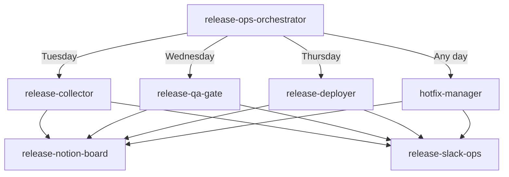

# Release Ops Orchestrator

Master orchestrator for the "Tuesday collection → Wednesday QA → Thursday deployment" weekly release cycle. Routes operations based on the current day and provides a unified entry point for all release activities.

## When to Use

- As the primary entry point for release operations
- When the user invokes `/release-ops` without specifying a phase
- When status overview across the full cycle is needed
- When the system needs to determine which phase to run automatically

## Prerequisites

- All sub-skills installed: `release-collector`, `release-qa-gate`, `release-deployer`, `hotfix-manager`, `release-notion-board`, `release-slack-ops`
- GitHub CLI, Notion MCP, Slack MCP configured
- Repository list and channel IDs configured in respective skill `config.json` files
- Rule file loaded: `.cursor/rules/release-ops-rules.mdc`

## Day-of-Week Routing

| Day | Primary Action | Skill | Fallback |
|---|---|---|---|
| Monday | Prepare release candidates, finalize labels | Status overview + reminder | N/A |
| Tuesday | Collect and validate PRs | `release-collector` | Manual collection |
| Wednesday | Track QA results, enforce gate | `release-qa-gate` | Manual QA tracking |
| Thursday | Lock list, deploy, confirm, retrospect | `release-deployer` | Manual deployment |
| Friday | Review retrospective, plan next week | Status overview | N/A |
| Any day | Hotfix submission | `hotfix-manager` | Manual hotfix |

## Workflow

### Mode 1: Auto-Route (Default)

When invoked without a specific mode, determine the current day (Asia/Seoul timezone) and route:

1. **Detect day of week** using system date
2. **Check for pending hotfixes** — if any `hotfix`-labeled PRs exist, offer hotfix processing regardless of day
3. **Route to the day's primary skill**:
   - Monday/Friday → Mode 3 (Status Overview)
   - Tuesday → `release-collector`
   - Wednesday → `release-qa-gate`
   - Thursday → `release-deployer`
4. **Report result** from the delegated skill

### Mode 2: Explicit Phase

When invoked with a specific phase argument:

- `collect` → `release-collector`
- `qa` → `release-qa-gate`
- `deploy` → `release-deployer`
- `hotfix` → `hotfix-manager`
- `status` → Mode 3

### Mode 3: Status Overview

Aggregate current release cycle state from all sources:

1. **Load latest state files** from `outputs/release-ops/{date}/`:
   - `collection.json` (from collector)
   - `qa-results.json` (from qa-gate)
   - `deploy-manifest.json` (from deployer)
   - `deploy-results.json` (from deployer)
   - `hotfix-*.json` (from hotfix-manager)

2. **Query Notion** for current week's release board status via `release-notion-board` Operation 4

3. **Generate status report**:
   ```
   📊 Release Status — Week of {monday_date}

   Phase: {current_phase}
   Target Deploy: {thursday_date}

   Collection: {n} items collected ({n} ready, {n} missing info)
   QA: {n} passed, {n} failed, {n} pending
   Deploy: {n} ready for release
   Hotfixes: {n} active

   Next Action: {what_to_do_next}
   ```

4. Post to `#release-control` if `--post` flag is set

### Mode 4: Monday Preparation Reminder

Post a reminder to `#release-control`:

```
📌 Release Week Start — {next_thursday_date}

Reminder for app owners:
1. Label release-candidate PRs with `release:thu`
2. Add app label (app:ai-platform or app:agent-studio)
3. Add risk label (risk:low, risk:medium, risk:high)
4. Ensure PR body follows the release template (5 sections)

Collection deadline: Tuesday {date} 10:00 AM KST
```

### Mode 5: Friday Retrospective Review

Review the week's deployment results:

1. Load `retrospective.json` from deployer output
2. Check if all improvement points were documented
3. Summarize the week's release health:
   - Items attempted vs deployed
   - QA pass rate
   - Hotfix count
   - Process compliance (template usage, label accuracy)

## Composition Pattern



## Output Artifacts

| Mode | Output | Persistence |
|---|---|---|
| Auto-Route | Delegated skill output | Via sub-skill |
| Status Overview | Status report markdown | `outputs/release-ops/{date}/status.md` |
| Monday Reminder | Slack message | `#release-control` |
| Friday Review | Week summary | `outputs/release-ops/{date}/weekly-summary.md` |

## Error Recovery

- If a sub-skill fails: report the failure, suggest manual fallback, and persist partial state
- If day detection fails: fall back to Mode 3 (Status Overview)
- If no state files exist for the current week: start fresh with Mode 2 `collect`

## Gotchas

- Timezone matters: all day-of-week routing uses Asia/Seoul (KST, UTC+9)
- The orchestrator does not enforce the rules directly — each sub-skill enforces rules relevant to its phase
- Hotfix routing takes priority: if hotfix PRs are detected, offer hotfix processing before the day's regular task
- The orchestrator is stateless — all state lives in `outputs/release-ops/{date}/` files and Notion
- When invoked on a "wrong" day (e.g., running collect on Wednesday), warn but allow with `--force` flag
