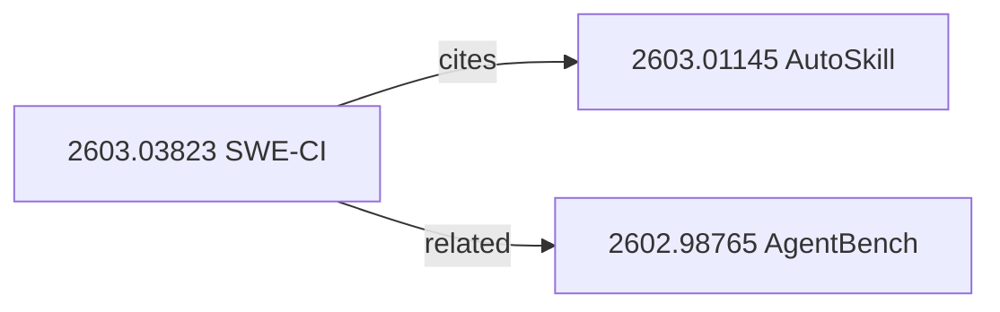
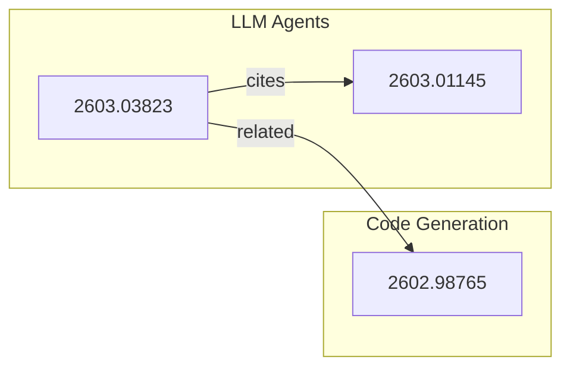

# Paper Archive — Workflow Steps

Detailed per-command instructions for the paper-archive skill.

## Common: Loading and Saving the Index

Every command starts by loading and ends by saving the index:

### Load

```python
import json, os

INDEX_PATH = "outputs/papers/index.json"

def load_index():
    if not os.path.exists(INDEX_PATH):
        return {"version": "1.0.0", "updated_at": "", "papers": [], "relationships": []}
    with open(INDEX_PATH) as f:
        return json.load(f)
```

### Save

```python
from datetime import datetime, timezone

def save_index(index):
    index["updated_at"] = datetime.now(timezone.utc).isoformat()
    with open(INDEX_PATH, "w") as f:
        json.dump(index, f, indent=2, ensure_ascii=False)
```

Always use `ensure_ascii=False` to preserve Korean characters in
`title_ko` and `one_line_summary`.

---

## register

### Step 1: Parse Input

Accept these input formats:
- arXiv URL: `https://arxiv.org/abs/2603.03823` or `https://arxiv.org/pdf/2603.03823`
- arXiv ID: `2603.03823` or `2603.03823v2`
- Non-arXiv URL: slugify the page title (e.g. `attention-is-all-you-need`)

Strip version suffixes (`v1`, `v2`) from the ID for dedup purposes — store
the versionless ID as the canonical key.

### Step 2: Dedup Check

```python
def find_paper(index, paper_id):
    return next((p for p in index["papers"] if p["id"] == paper_id), None)
```

If found and `--force` is not set, print the existing entry and stop.

### Step 3: Fetch Metadata

Try these sources in order (stop at first success):

**Source A — Semantic Scholar API**

```bash
curl -s "https://api.semanticscholar.org/graph/v1/paper/ArXiv:{ID}?fields=title,authors,year,abstract,externalIds,citationCount,fieldsOfStudy,venue"
```

Extract: `title`, `authors[].name`, `year`, `abstract` (for one_line_summary),
`fieldsOfStudy` (for tags), `citationCount`.

Rate limit: 100 requests/5 min for unauthenticated. Add 1s delay between
calls if batching.

**Source B — AlphaXiv Overview**

```bash
curl -s "https://alphaxiv.org/overview/{ID}.md"
```

Parse the markdown for title, authors, and summary.

**Source C — Defuddle + arXiv Page**

```bash
curl -s "https://defuddle.md/arxiv.org/abs/{ID}"
```

Parse YAML frontmatter for title, author, published date.

### Step 4: Scan Existing Artifacts

```bash
ls outputs/papers/{ID}-* 2>/dev/null
ls outputs/presentations/{ID}-* 2>/dev/null
```

Map found files to artifact types:
- `*-review-*.md` → `artifacts.review`
- `*-pm-strategy-*.md`, `*-market-research-*.md`, etc. → `artifacts.pm_analyses`
- `*-analysis-*.docx` → `artifacts.docx`
- `*-presentation-*.pptx` → `artifacts.pptx`
- `*-nlm-slides-*.pdf` → `artifacts.nlm_slides`
- `*-overview.md` → `artifacts.overview`
- `*-related-papers-*.md` → `artifacts.related_report`

### Step 5: Determine Status

- If `--status` is explicitly set, use it.
- Else if `artifacts.review` exists → `reviewed`
- Else if `artifacts.overview` exists → `overview-only`
- Else → `discovered`

### Step 6: Build Entry and Save

Construct the `PaperEntry` object per `index-schema.md`, append to
`index["papers"]`, and save.

### Step 7: Memory Integration

Append to `memory/sessions/paper-archive-{DATE}.md`:

```markdown
## Paper Registered: {title} ({id})
- Status: {status}
- Tags: {tags}
- Source: {source_skill}
- Artifacts: {list of non-null artifact paths}
```

---

## list

### Filtering Logic

1. Load index.
2. Start with all papers.
3. If `--status` is set (not `all`): filter to matching status.
4. If `--tag` is set: filter to papers where any tag contains the
   substring (case-insensitive).
5. Sort by `--sort` field (`date` = `date_archived` desc, `title` = `title` asc).
6. Truncate to `--limit`.

### Output Format

Display as a markdown table. For each paper show:
`#`, `id`, `title` (truncated to 50 chars), `status`, `tags` (joined),
`date_archived`.

If no papers match, display: "No papers found matching the criteria."

---

## search

### Scoring Algorithm

For each paper, compute a relevance score:

```
score = 0
for keyword in query_keywords:
    if keyword in paper.title.lower():     score += 3
    if keyword in paper.tags:              score += 2
    if keyword in paper.one_line_summary:  score += 1
    for author in paper.authors:
        if keyword in author.lower():      score += 1
```

Return papers with `score > 0`, sorted descending, top 10.

### Output

Same table format as `list`, plus a `Score` column.

---

## check

1. Parse arXiv ID from input.
2. Look up in index.
3. If found:
   ```
   Paper found in archive:
     ID:       2603.03823
     Title:    SWE-CI: Evaluating...
     Status:   reviewed
     Archived: 2026-03-12
     Artifacts: review, docx, pptx, nlm_slides, 6 pm_analyses
   ```
4. If not found:
   ```
   Paper 2603.03823 is NOT in the archive.
   Run: paper-archive register 2603.03823
   ```

---

## relate

1. Verify both paper IDs exist in the index. If either is missing, suggest
   `register` first.
2. Check for existing relationship between the pair (in either direction).
   If exists, report it and stop.
3. Create a `Relationship` entry:
   ```json
   {
     "from": "paper-A-ID",
     "to": "paper-B-ID",
     "type": "related",
     "discovered_by": "manual",
     "date_added": "YYYY-MM-DD"
   }
   ```
4. Update `related_papers` on both paper entries (add the other's ID if
   not already present).
5. Save index.

---

## graph

### Single Paper Graph

Find all relationships where the paper is `from` or `to`. Build a 1-hop
subgraph. Render as mermaid:



### Full Archive Graph

Render all papers and relationships. If >15 papers, group by the most
common tag into subgraphs:



---

## sync-nlm

### Step 1: Find or Create Notebook

```
notebook_list() → search for title containing "Paper Library"
```

If not found:
```
notebook_create(title="Paper Library")
```

Store the notebook ID for subsequent operations.

### Step 2: Sync Papers

For each paper where `status` is `reviewed` or `archived` AND
`nlm_notebook_id` is null:

1. If `artifacts.review` exists, add as text source:
   ```
   source_add(notebook_id, source_type="file", file_path="<ABSOLUTE_PATH>/{artifacts.review}")
   ```
2. If `arxiv_url` exists, add as URL source:
   ```
   source_add(notebook_id, source_type="url", url="{arxiv_url}")
   ```
3. Update paper's `nlm_notebook_id` to the notebook ID.
4. Promote `status` to `archived` if not already.

### Step 3: Save Index

Save updated index with new `nlm_notebook_id` values and status changes.

---

## sync-notion

### Step 1: Identify Unsynced Papers

Filter papers where `status` is `reviewed` or `archived` AND
`notion_page_id` is null.

### Step 2: Create Notion Pages

For each unsynced paper, create a page under the parent.
**Token-first**: use `scripts/notion_api.py` (`NotionClient.create_page()`).
**Fallback**: use `notion-create-pages` MCP tool when `NOTION_TOKEN` is unavailable.

- Title: `{paper.title} ({paper.date_archived})`
- Content: paper metadata table + one_line_summary + list of artifact links

### Step 3: Update Index

Set `notion_page_id` on each synced paper. Promote status to `archived`
if NLM is also synced.

---

## stats

Load index and compute:

1. Total papers count.
2. Count by status.
3. Tag frequency (sort descending, show top 10).
4. Relationship count by type.
5. NLM sync ratio: papers with `nlm_notebook_id` / papers with status
   `reviewed` or `archived`.
6. Notion sync ratio: same logic with `notion_page_id`.
7. Last `updated_at` from the index.

---

## export

### Markdown Format

```markdown
# Paper Archive Report — {DATE}

## Summary
- Total: {N} papers
- {status breakdown}

## Papers

| # | ID | Title | Status | Tags | Archived |
|---|-------|-------|--------|------|----------|
| 1 | ... | ... | ... | ... | ... |

## Relationship Graph

{mermaid diagram from `graph` command}

## Paper Details

### {Paper Title} ({ID})
- **Status**: {status}
- **Authors**: {authors}
- **Tags**: {tags}
- **Archived**: {date_archived}
- **Summary**: {one_line_summary}
- **Artifacts**: {list}
- **Related papers**: {list}
```

Save to `outputs/papers/archive-report-{DATE}.md`.

### JSON Format

Pretty-print `index.json` to the output path.

---

## Error Handling

| Error | Command | Resolution |
|-------|---------|------------|
| index.json parse error | any | Back up corrupted file, create fresh scaffold |
| Semantic Scholar 429 | register | Wait 3s, retry once; fall back to AlphaXiv |
| Semantic Scholar 404 | register | Paper not indexed yet; use AlphaXiv/Defuddle |
| arXiv ID not parseable | register, check | Report invalid format, show examples |
| NLM notebook not found | sync-nlm | Create new "Paper Library" notebook |
| NLM source_add fails | sync-nlm | Check file path is absolute; verify auth |
| Notion MCP disconnected | sync-notion | Report error, suggest reconnecting MCP |
| File artifact missing | register | Warn but do not block; set artifact to null |
