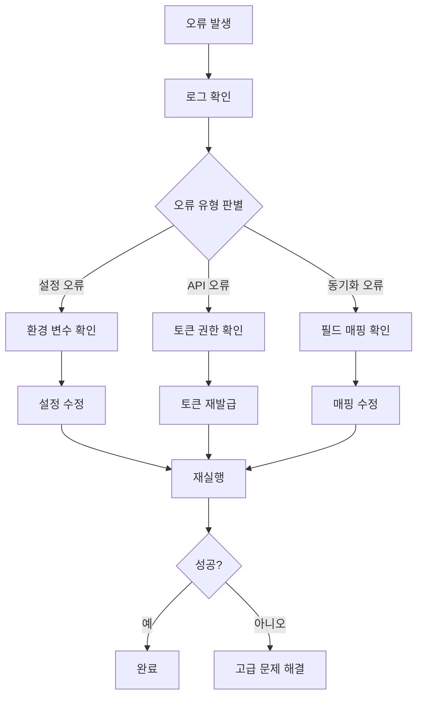

# Design Document

## Overview

이 설계는 GitHub 프로젝트(<https://github.com/orgs/ThakiCloud/projects/5)를> Notion 데이터베이스에 주기적으로 동기화하는 GitHub Actions 워크플로우 설정 및 운영을 위한 포괄적인 단계별 가이드 문서를 작성하는 것입니다.

기존 시스템 분석 결과, 이미 완전한 동기화 시스템이 구축되어 있으며, FastAPI 기반의 웹훅 서버, 동기화 서비스, 그리고 다양한 스크립트들이 존재합니다. 가이드 문서는 이러한 기존 시스템을 활용하여 GitHub Actions를 통한 자동화된 동기화를 설정하는 방법을 제공합니다.

## Architecture

### 문서 구조 설계

```
docs/
├── GITHUB_NOTION_SYNC_GUIDE.md (메인 가이드)
├── sections/
│   ├── 01-prerequisites.md
│   ├── 02-environment-setup.md
│   ├── 03-github-actions-setup.md
│   ├── 04-monitoring-troubleshooting.md
│   └── 05-customization.md
└── assets/
    ├── workflow-diagram.md
    └── screenshots/ (필요시)
```

### 가이드 문서 아키텍처

1. **메인 가이드 문서**: 전체 프로세스의 개요와 빠른 시작 가이드
2. **섹션별 상세 문서**: 각 단계별 상세 설명
3. **참조 자료**: 워크플로우 다이어그램, 설정 예제

### 기존 시스템 통합

기존 시스템의 주요 구성 요소:

- **FastAPI 애플리케이션** (`src/main.py`): 웹훅 처리 및 API 엔드포인트
- **동기화 서비스** (`src/services/`): GitHub와 Notion 간 데이터 동기화
- **설정 관리** (`config/`): 필드 매핑 및 동기화 설정
- **스크립트** (`scripts/`): 수동 동기화 및 검증 도구

## Components and Interfaces

### 1. 메인 가이드 문서 (GITHUB_NOTION_SYNC_GUIDE.md)

**목적**: 전체 프로세스의 개요와 빠른 시작 가이드 제공

**구성 요소**:

- 프로젝트 개요 및 아키텍처 설명
- 빠른 시작 가이드 (Quick Start)
- 각 섹션으로의 링크
- 문제 해결 빠른 참조

**인터페이스**:

- 다른 섹션 문서들과의 링크 연결
- 기존 문서들 (SETUP.md, ARCHITECTURE.md 등)과의 참조 관계

### 2. 전제 조건 문서 (01-prerequisites.md)

**목적**: 시작하기 전 필요한 준비사항 안내

**구성 요소**:

- 필수 계정 및 권한 (GitHub, Notion)
- 필요한 도구 및 소프트웨어
- 기존 프로젝트 구조 이해
- API 토큰 발급 방법

**데이터 모델**:

```yaml
prerequisites:
  accounts:
    - github_org_access
    - notion_workspace_access
  tools:
    - python_3.8+
    - git
    - text_editor
  tokens:
    - github_personal_access_token
    - notion_integration_token
```

### 3. 환경 설정 문서 (02-environment-setup.md)

**목적**: 로컬 환경 및 GitHub 저장소 설정 방법

**구성 요소**:

- 저장소 클론 및 의존성 설치
- 환경 변수 설정 (.env 파일)
- 설정 파일 커스터마이징 (field_mappings.yml)
- 초기 검증 및 테스트

**설정 템플릿**:

```bash
# 환경 변수 템플릿
GH_TOKEN=your_github_token
NOTION_TOKEN=your_notion_token
GH_ORG=ThakiCloud
GH_PROJECT_NUMBER=5
NOTION_DB_ID=your_notion_database_id
GH_WEBHOOK_SECRET=your_webhook_secret
```

### 4. GitHub Actions 설정 문서 (03-github-actions-setup.md)

**목적**: GitHub Actions 워크플로우 생성 및 설정

**구성 요소**:

- 워크플로우 파일 생성 (.github/workflows/notion-sync.yml)
- 시크릿 설정 (GitHub Repository Secrets)
- 스케줄링 설정 (cron 표현식)
- 수동 트리거 설정
- 워크플로우 테스트 및 검증

**워크플로우 템플릿**:

```yaml
name: GitHub to Notion Sync
on:
  schedule:
    - cron: "0 */6 * * *" # 6시간마다
  workflow_dispatch: # 수동 실행

jobs:
  sync:
    runs-on: ubuntu-latest
    steps:
      - uses: actions/checkout@v4
      - name: Setup Python
        uses: actions/setup-python@v4
        with:
          python-version: "3.11"
      - name: Install dependencies
        run: |
          pip install -r requirements.txt
      - name: Run sync
        env:
          GH_TOKEN: ${{ secrets.GH_TOKEN }}
          NOTION_TOKEN: ${{ secrets.NOTION_TOKEN }}
          # ... 기타 환경 변수
        run: python scripts/full_sync.py
```

### 5. 모니터링 및 문제 해결 문서 (04-monitoring-troubleshooting.md)

**목적**: 동기화 상태 모니터링 및 문제 해결 방법

**구성 요소**:

- GitHub Actions 로그 해석
- 일반적인 오류 시나리오 및 해결책
- 동기화 상태 확인 방법
- 성능 최적화 팁
- 백업 및 복구 절차

**모니터링 지표**:

```yaml
monitoring_metrics:
  success_indicators:
    - workflow_completion_status
    - sync_item_counts
    - error_rates
  failure_indicators:
    - api_rate_limits
    - authentication_errors
    - field_mapping_errors
```

### 6. 커스터마이제이션 문서 (05-customization.md)

**목적**: 시스템 확장 및 커스터마이제이션 방법

**구성 요소**:

- 필드 매핑 수정 방법
- 새로운 GitHub 이벤트 추가
- 동기화 빈도 조정
- 웹훅 설정 (선택사항)
- 고급 설정 옵션

## Data Models

### 가이드 문서 메타데이터

```yaml
guide_metadata:
  title: "GitHub Projects to Notion 동기화 가이드"
  version: "1.0.0"
  last_updated: "2024-01-XX"
  target_audience: ["개발자", "프로젝트 관리자", "DevOps 엔지니어"]
  difficulty_level: "중급"
  estimated_time: "30-60분"
```

### 설정 템플릿 구조

```yaml
configuration_templates:
  environment_variables:
    required:
      - GH_TOKEN
      - NOTION_TOKEN
      - GH_ORG
      - GH_PROJECT_NUMBER
      - NOTION_DB_ID
      - GH_WEBHOOK_SECRET
    optional:
      - LOG_LEVEL
      - BATCH_SIZE
      - ENVIRONMENT

  field_mappings:
    core_fields:
      - title
      - github_node_id
      - status
      - assignees
    optional_fields:
      - priority
      - labels
      - due_date
      - story_points
```

### 워크플로우 설정 옵션

```yaml
workflow_options:
  scheduling:
    - cron: "0 */6 * * *" # 6시간마다
    - cron: "0 9 * * 1-5" # 평일 오전 9시
    - cron: "0 0 * * *" # 매일 자정

  triggers:
    - schedule
    - workflow_dispatch
    - push (선택사항)

  environments:
    - production
    - staging
    - development
```

## Error Handling

### 문서 내 오류 처리 가이드

1. **일반적인 설정 오류**

   - 환경 변수 누락
   - API 토큰 권한 부족
   - 잘못된 데이터베이스 ID

2. **GitHub Actions 오류**

   - 워크플로우 실행 실패
   - 시크릿 설정 오류
   - 의존성 설치 실패

3. **동기화 오류**
   - API 레이트 리밋 초과
   - 필드 매핑 오류
   - 네트워크 연결 문제

### 오류 해결 프로세스



## Testing Strategy

### 문서 검증 방법

1. **단계별 검증**

   - 각 섹션의 지시사항을 실제로 따라해보기
   - 스크린샷 및 예제 출력 확인
   - 일반적인 실수 시나리오 테스트

2. **사용자 테스트**

   - 신규 팀 구성원을 대상으로 가이드 테스트
   - 피드백 수집 및 개선사항 반영
   - 다양한 환경에서의 테스트 (macOS, Linux, Windows)

3. **자동화된 검증**
   - 기존 `scripts/validate_setup.py` 활용
   - 가이드에서 제공하는 설정의 유효성 검증
   - CI/CD 파이프라인에서 문서 링크 검증

### 품질 보증

```yaml
quality_assurance:
  content_review:
    - technical_accuracy
    - clarity_and_readability
    - completeness
    - up_to_date_information

  user_experience:
    - step_by_step_clarity
    - error_handling_coverage
    - troubleshooting_effectiveness
    - time_to_completion

  maintenance:
    - regular_updates
    - version_control
    - feedback_incorporation
```

### 성공 지표

- 가이드를 따라 30분 내에 동기화 설정 완료 가능
- 일반적인 오류 시나리오 90% 이상 커버
- 신규 사용자의 첫 번째 시도 성공률 80% 이상
- 문서 업데이트 주기: 분기별 또는 주요 시스템 변경 시
