# Information Architecture

Daily Sprint Sync 시스템의 정보 아키텍처 문서입니다.

---

## 1. 시스템 개요

### 1.1 아키텍처 목적

Daily Sprint Sync는 **GitHub Projects 중심 데이터 모델**을 기반으로 스프린트 데이터를 Notion으로 동기화하여 팀이 효율적으로 작업을 추적하고 공유할 수 있도록 설계되었습니다.

### 1.2 핵심 컨셉

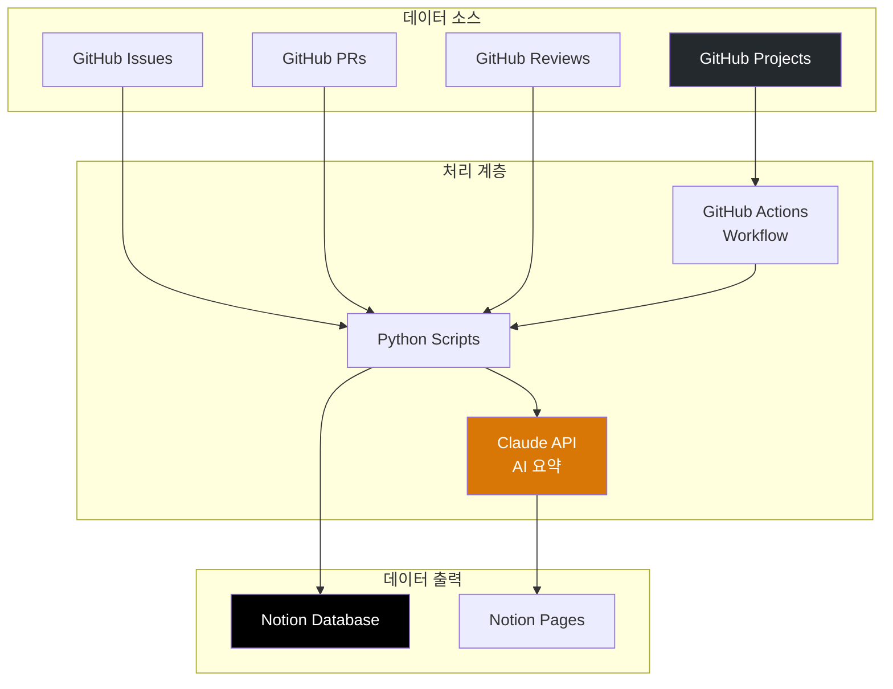

### 1.3 주요 특징

- **스프린트 기반 필터링**: 모든 데이터는 스프린트 단위로 필터링
- **자동 스케줄링**: 매일 KST 07:30 자동 실행
- **AI 기반 요약**: Claude API를 활용한 지능형 요약
- **중복 방지**: GitHub Node ID 기반 중복 체크

---

## 2. 시스템 컨텍스트 다이어그램

### 2.1 C4 Level 1 - 시스템 컨텍스트

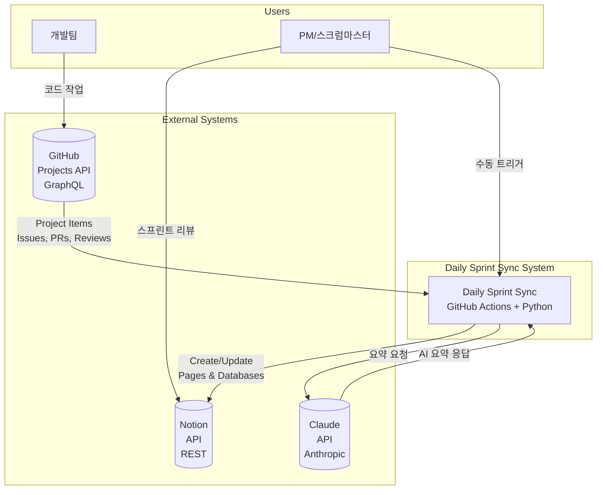

### 2.2 C4 Level 2 - 컨테이너 다이어그램

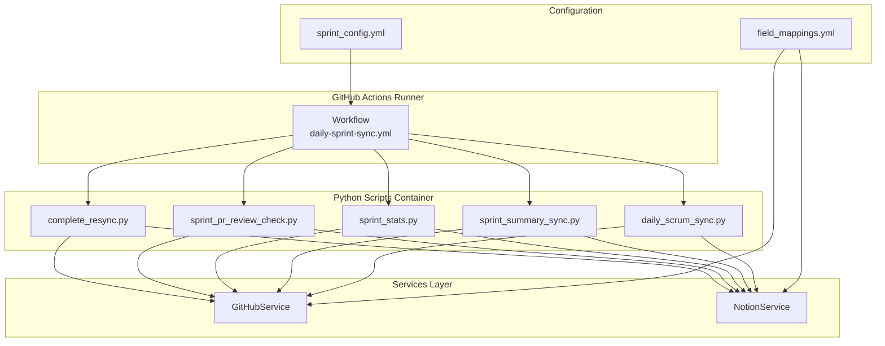

---

## 3. 데이터 플로우

### 3.1 전체 동기화 플로우 (Complete Resync)

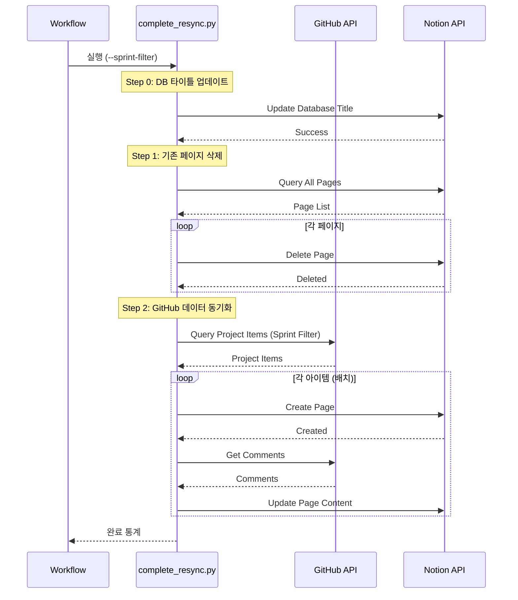

### 3.2 AI 요약 플로우 (Sprint Summary / Daily Scrum)

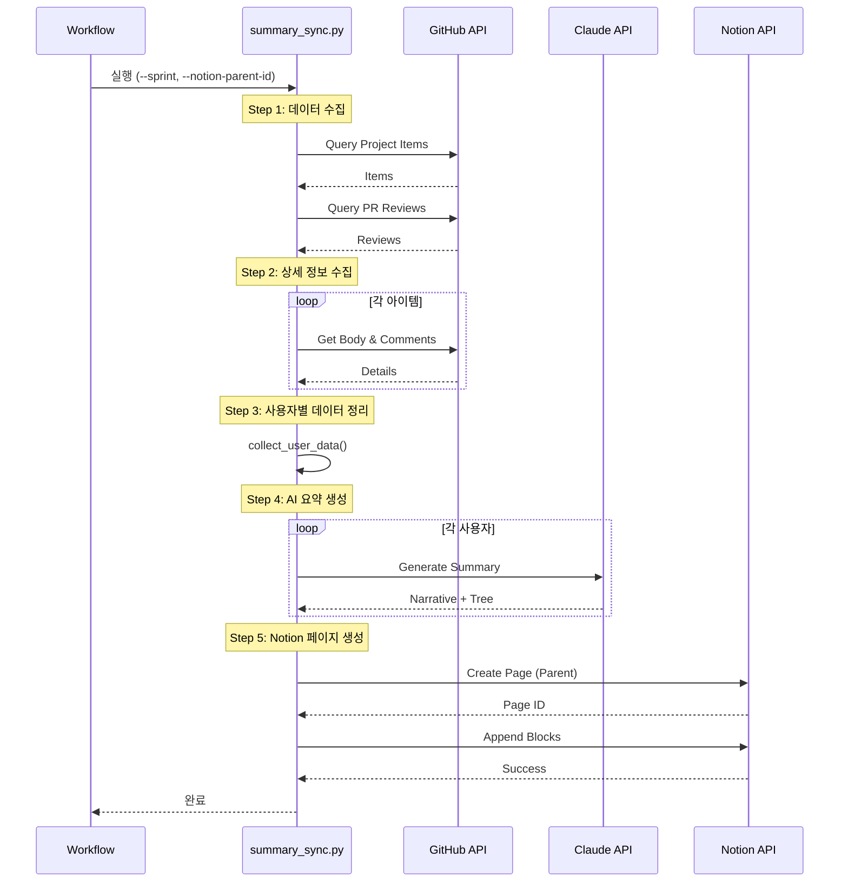

---

## 4. 컴포넌트 아키텍처

### 4.1 모듈 구조

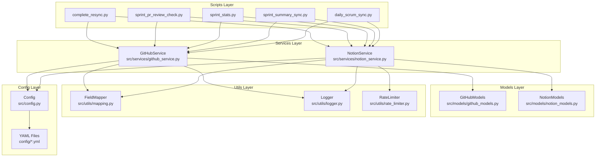

### 4.2 서비스 간 의존성

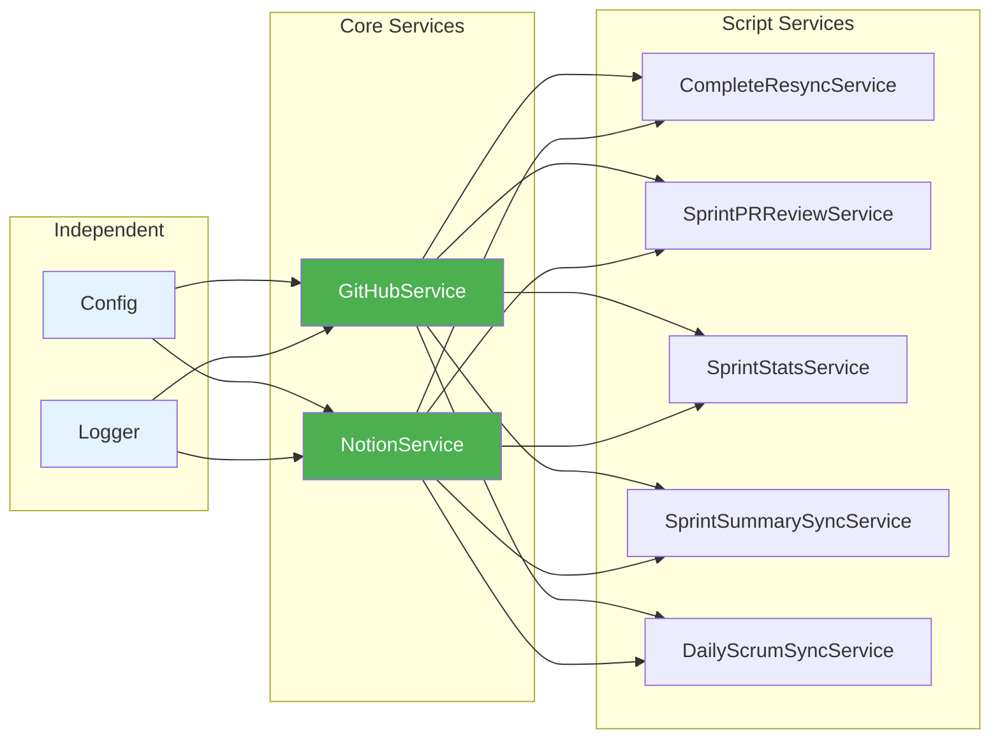

---

## 5. 데이터 모델

### 5.1 GitHub 데이터 모델

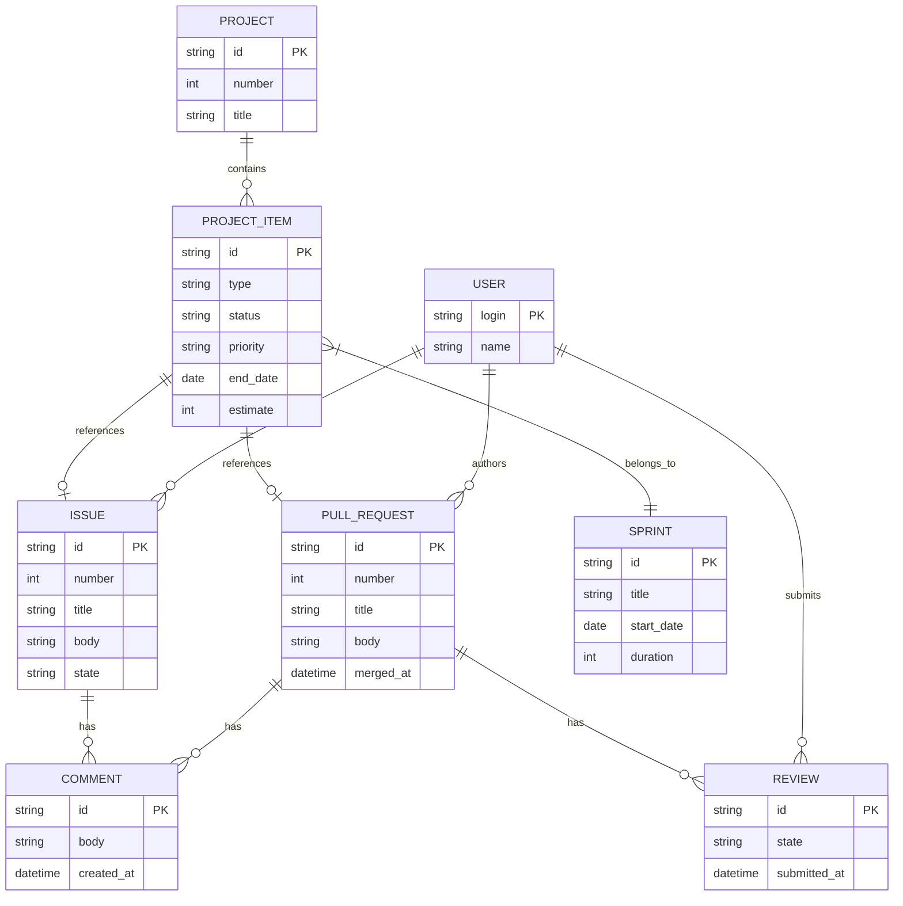

### 5.2 Notion 출력 데이터 모델

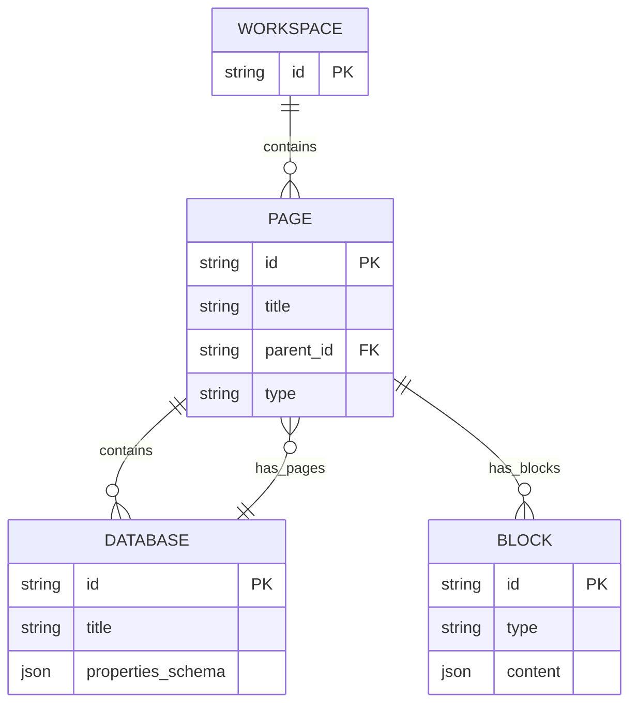

---

## 6. 워크플로우 실행 플로우

### 6.1 전체 실행 순서

```mermaid
flowchart TD
    START([시작]) --> CHECKOUT[코드 체크아웃]
    CHECKOUT --> CONFIG[설정 로드<br/>sprint_config.yml]
    CONFIG --> SETUP[Python 환경 설정]
    SETUP --> DEPS[의존성 설치]
    DEPS --> ENV[환경 변수 설정]

    ENV --> COND1{run_complete_resync?}
    COND1 -->|Yes| RESYNC[Complete Resync<br/>30분 타임아웃]
    COND1 -->|No| COND2

    RESYNC --> COND2{run_pr_review_check?}
    COND2 -->|Yes| PRCHECK[PR Review Check<br/>15분 타임아웃]
    COND2 -->|No| COND3

    PRCHECK --> COND3{run_sprint_stats?}
    COND3 -->|Yes| STATS[Sprint Stats<br/>15분 타임아웃]
    COND3 -->|No| COND4

    STATS --> COND4{run_sprint_summary?}
    COND4 -->|Yes| SUMMARY[Sprint Summary<br/>15분 타임아웃]
    COND4 -->|No| COND5

    SUMMARY --> COND5{run_daily_scrum?}
    COND5 -->|Yes| SCRUM[Daily Scrum<br/>15분 타임아웃]
    COND5 -->|No| UPLOAD

    SCRUM --> UPLOAD[Artifacts 업로드]
    UPLOAD --> END([종료])

    style RESYNC fill:#4CAF50,color:#fff
    style PRCHECK fill:#2196F3,color:#fff
    style STATS fill:#9C27B0,color:#fff
    style SUMMARY fill:#FF9800,color:#fff
    style SCRUM fill:#E91E63,color:#fff
```

### 6.2 설정 우선순위

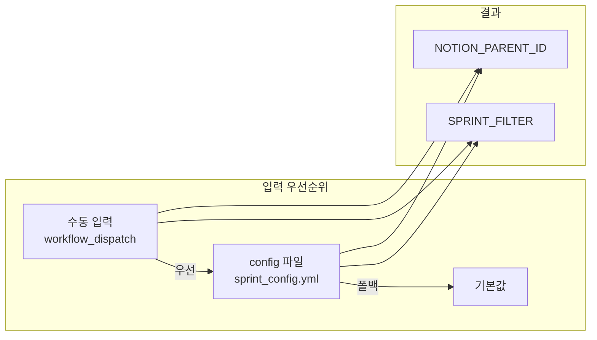

---

## 7. 상태 관리

### 7.1 동기화 상태

| 상태 | 의미 | 처리 |
|------|------|------|
| `synced` | 동기화 완료 | - |
| `pending` | 대기 중 | 다음 실행 시 처리 |
| `failed` | 실패 | 재시도 또는 로그 기록 |
| `skipped` | 스킵됨 | 필터 조건 불일치 |

### 7.2 GitHub Node ID 기반 중복 방지

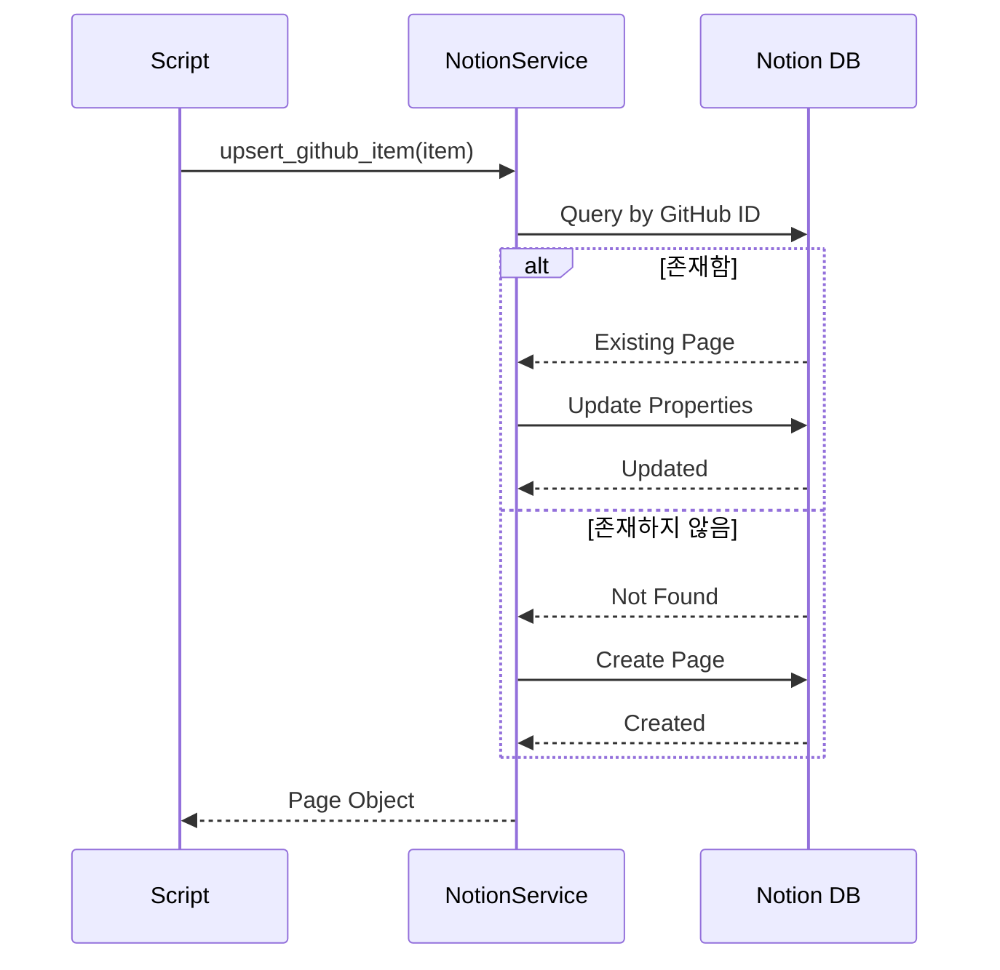

---

## 8. 요약 및 핵심 인사이트

### 8.1 핵심 IA 특징

1. **스프린트 중심 필터링**
   - 모든 데이터는 스프린트 단위로 필터링
   - `config/sprint_config.yml`에서 현재 스프린트 관리

2. **자동화된 실행**
   - 매일 KST 07:30 자동 실행 (cron: UTC 22:30)
   - 수동 트리거 지원 (workflow_dispatch)
   - 선택적 기능 실행 옵션

3. **AI 기반 요약**
   - Claude claude-sonnet-4-20250514 모델 사용
   - 서술형 요약 + 작업 트리 생성
   - 리포지토리별 그룹화

4. **Rate Limit 대응**
   - 배치 처리 (50개 단위)
   - 요청 간 딜레이 (0.3초 ~ 1초)
   - 지수 백오프 재시도

### 8.2 설계 결정사항

| 설계 영역 | 결정사항 | 이유 |
|----------|---------|------|
| **실행 시간** | KST 07:30 | 업무 시작 전 데이터 준비 |
| **배치 크기** | 50개 | Rate limit 방지 + 적절한 처리 속도 |
| **성공 기준** | 90% 이상 | 일부 실패 허용하여 전체 프로세스 안정성 확보 |
| **AI 모델** | Claude claude-sonnet-4-20250514 | 비용 대비 품질 균형 |
| **시간대** | KST (UTC+9) | 한국 팀 기준 |

### 8.3 데이터 출력 위치

| 기능 | 출력 위치 | 설정 키 |
|------|----------|---------|
| Complete Resync | 기존 Notion DB | `NOTION_DB_ID` |
| PR Review Check | PR-Checker 하위 | `notion_parent_id` |
| Sprint Stats | PR-Checker 하위 | `notion_parent_id` |
| Sprint Summary | SprintChecker 하위 | `sprint_checker_parent_id` |
| Daily Scrum | DailyScrum 하위 | `daily_scrum_parent_id` |

